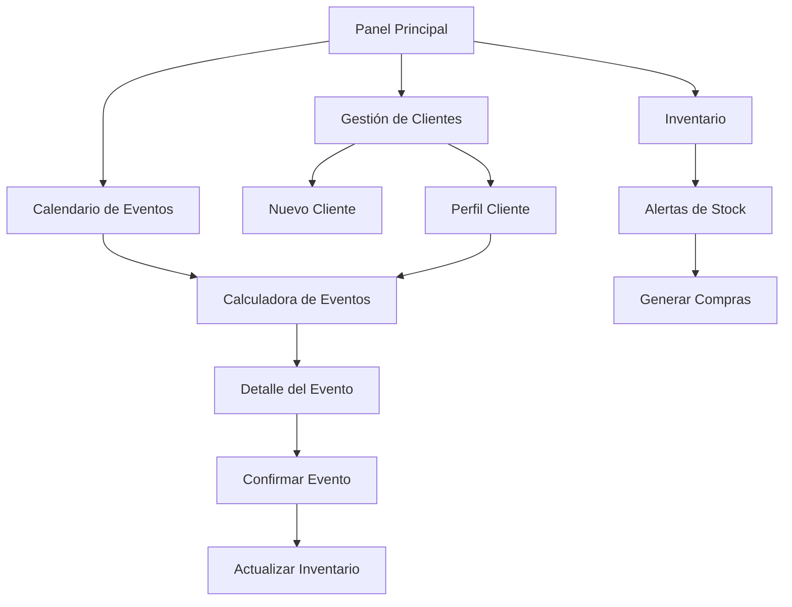

## 1. Descripción del Producto

Aplicación SaaS para gestión integral de servicios de alimentos y snacks para eventos. Permite organizar clientes, eventos, calcular costos de ingredientes, gestionar inventario y ofrecer descuentos a clientes recurrentes. Diseñada para escalar como servicio multi-tenant.

**Problema que resuelve:** Organización manual de eventos, cálculo impreciso de ingredientes, falta de seguimiento de clientes recurrentes y dificultad para escalar el negocio.

**Valor del mercado:** Herramienta esencial para emprendedores de servicios de alimentos en eventos, con potencial de monetización mensual por usuario.

## 2. Funcionalidades Principales

### 2.1 Roles de Usuario

| Rol | Método de Registro | Permisos Principales |
|------|---------------------|------------------|
| Administrador | Email + verificación | Acceso total, configuración de planes, gestión de tenants |
| Usuario Premium | Suscripción mensual | Clientes ilimitados, eventos ilimitados, reportes avanzados |
| Usuario Básico | Registro gratuito | Máximo 10 clientes, 20 eventos/mes, funciones básicas |

### 2.2 Módulos de Funcionalidades

Nuestra aplicación de gestión de eventos consta de las siguientes páginas principales:

1. **Panel Principal**: Dashboard con métricas, próximos eventos, clientes recurrentes
2. **Calendario de Eventos**: Vista mensual/semanal de eventos agendados con estados
3. **Gestión de Clientes**: Lista de clientes, datos de contacto, historial completo
4. **Calculadora de Eventos**: Configuración de productos, cálculo de ingredientes y costos
5. **Detalle del Evento**: Información completa del evento, packing list, seguimiento
6. **Inventario**: Stock de ingredientes, máquinas, carritos y equipos
7. **Configuración**: Perfil de usuario, configuración de productos y precios

### 2.3 Detalle de Páginas

| Página | Módulo | Descripción de Funcionalidades |
|-----------|-------------|---------------------|
| Panel Principal | Métricas generales | Mostrar total de eventos del mes, clientes activos, ingresos proyectados, eventos próximos a vencer |
| Panel Principal | Clientes recurrentes | Listar top 5 clientes con más eventos, mostrar total gastado y sugerencias de descuento |
| Panel Principal | Alertas | Notificar eventos sin confirmar, ingredientes bajos en stock, eventos del día siguiente |
| Calendario de Eventos | Vista mensual | Mostrar todos los eventos del mes con colores por estado (presupuestado/confirmado/completado) |
| Calendario de Eventos | Vista semanal | Detalle de eventos por semana con información básica de cliente y tipo de servicio |
| Calendario de Eventos | Filtrado | Filtrar por estado del evento, tipo de servicio, cliente específico |
| Gestión de Clientes | Lista de clientes | Mostrar nombre, teléfono, email, total de eventos y monto total gastado |
| Gestión de Clientes | Búsqueda avanzada | Buscar por nombre, teléfono, fecha de último evento, rango de gasto |
| Gestión de Clientes | Perfil del cliente | Ver datos de contacto, direcciones frecuentes, preferencias de servicio, notas internas |
| Gestión de Clientes | Historial de eventos | Listar todos los eventos anteriores con fecha, tipo de servicio, cantidad de personas y monto |
| Calculadora de Eventos | Configuración de productos | Crear/editar productos (churros, elotes, paletas) con recetas estándar |
| Calculadora de Eventos | Cálculo por personas | Ingresar número de personas y calcular automáticamente cantidad de ingredientes necesarios |
| Calculadora de Eventos | Costos y precios | Mostrar costo total de ingredientes, costo por persona, precio de venta sugerido y margen de ganancia |
| Calculadora de Eventos | Personalización | Ajustar cantidades manualmente, agregar productos adicionales, aplicar descuentos |
| Detalle del Evento | Información general | Mostrar fecha, hora, dirección, tipo de servicio, número de personas, estado del evento |
| Detalle del Evento | Packing list | Generar lista de ingredientes, máquinas necesarias, utensilios y carritos de servicio |
| Detalle del Evento | Seguimiento | Marcar como confirmado, completado, cancelado; agregar notas del evento |
| Inventario | Ingredientes | Registrar stock de harina, azúcar, palitos, vasos, mayonesa, queso, chile, etc. |
| Inventario | Máquinas y equipos | Control de máquinas de churros, carritos, mesas, sillas, mantelería |
| Inventario | Alertas | Notificar cuando ingredientes estén por debajo del mínimo configurado |
| Configuración | Perfil de usuario | Editar nombre, email, teléfono, logo de la empresa, datos fiscales |
| Configuración | Catálogo de productos | Crear/editar productos con sus recetas, tiempos de preparación, presentación |
| Configuración | Precios y márgenes | Configurar márgenes de ganancia por tipo de producto, precios base |

## 3. Flujos Principales

### Flujo de Creación de Evento
1. Usuario accede a Calendario de Eventos
2. Click en fecha deseada → Crear nuevo evento
3. Seleccionar cliente existente o crear nuevo
4. Configurar tipo de servicio y número de personas
5. Calculadora genera lista de ingredientes y costos
6. Ajustar precio de venta y aplicar descuento si corresponde
7. Confirmar evento y generar packing list

### Flujo de Cliente Recurrente
1. Al seleccionar cliente, sistema muestra:
   - Total de eventos previos
   - Monto total gastado
   - Promedio de gasto por evento
   - Sugerencia de descuento basada en frecuencia
2. Usuario decide aplicar descuento o no
3. Sistema registra descuento aplicado para reportes

### Flujo de Gestión de Inventario
1. Registrar movimientos de entrada/salida de ingredientes
2. Sistema actualiza stock automáticamente al confirmar eventos
3. Alertas cuando stock baja del mínimo
4. Generar reporte de compras necesarias

## 4. Diseño de Interfaz

### 4.1 Estilo de Diseño
- **Colores principales**: Naranja (#FF6B35) y verde (#4CAF50) para transmitir calidez y frescura
- **Colores secundarios**: Gris claro (#F5F5F5) y blanco para fondos
- **Estilo de botones**: Redondeados con sombras suaves, hover effects
- **Tipografía**: Font sans-serif moderna (Inter o Roboto), tamaños 14-16px para texto, 18-24px para títulos
- **Estilo de layout**: Tarjetas (cards) con bordes redondeados, navegación lateral collapsable
- **Iconos**: Estilo lineal moderno, usar emojis relevantes para categorías de productos

### 4.2 Diseño de Páginas

| Página | Módulo | Elementos de UI |
|-----------|-------------|-------------|
| Panel Principal | Métricas | Tarjetas con números grandes, iconos coloridos, gráficos de barras para ingresos mensuales |
| Panel Principal | Alertas | Badges con colores de semáforo (rojo/amarillo/verde), notificaciones en tiempo real |
| Calendario | Vista mensual | Grid 7x5 con celdas de diferentes colores según estado, tooltip al hover con info básica |
| Calculadora | Formulario | Inputs numéricos con incrementadores, cards para cada producto, preview de costos en tiempo real |
| Clientes | Lista | Tabla responsive con avatar, badges de frecuencia, botones de acción compactos |
| Inventario | Stock | Tabla con barras de progreso para niveles de stock, colores rojo/amarillo/verde |

### 4.3 Responsividad
- Diseño desktop-first con adaptación mobile
- Sidebar collapsable en tablets y móviles
- Tablas horizontales con scroll en móviles
- Botones de tamaño táctil (mínimo 44px) para facilitar interacción

## 5. Funcionalidades Adicionales Sugeridas

### Sistema de Descuentos Inteligente
- Automatizar descuentos basados en:
  - Número de eventos del cliente (ej: 5% después de 5 eventos)
  - Monto total gastado (ej: 10% si supera $5000)
  - Frecuencia mensual (ej: 15% si tiene eventos cada mes)

### Gestión de Personal
- Registrar staff asignado a cada evento
- Control de pagos a personal
- Evaluación de desempeño por evento

### Integración con WhatsApp
- Enviar confirmaciones de eventos por WhatsApp
- Recordatorios automáticos 24h antes
- Agradecimientos post-evento

### Reportes y Analytics
- Gráficos de crecimiento mensual
- Productos más rentables
- Estacionalidad de servicios
- Predicción de ingredientes necesarios

### Gestión de Proveedores
- Catálogo de proveedores por ingrediente
- Comparación de precios
- Órdenes de compra automatizadas
- Control de calidad