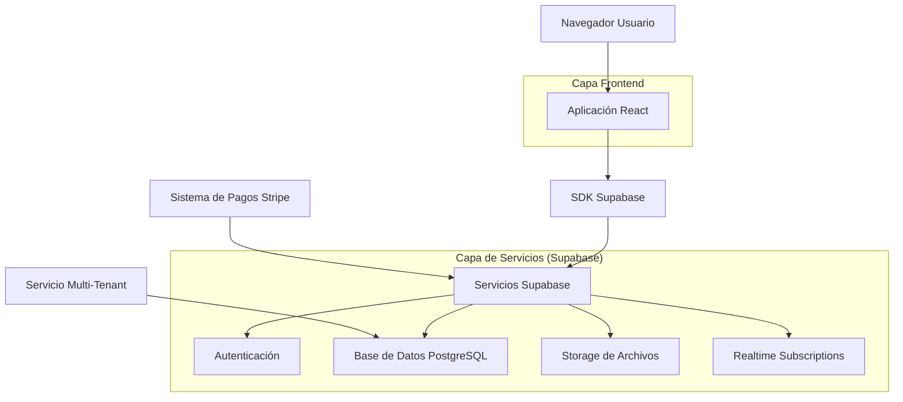
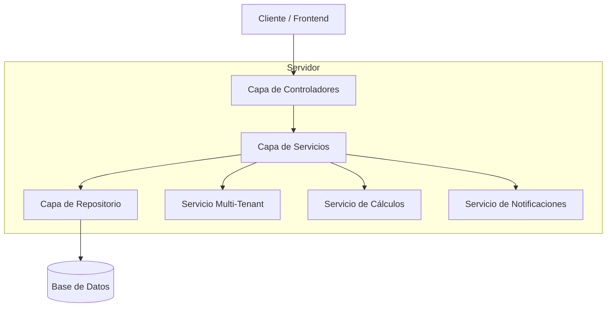
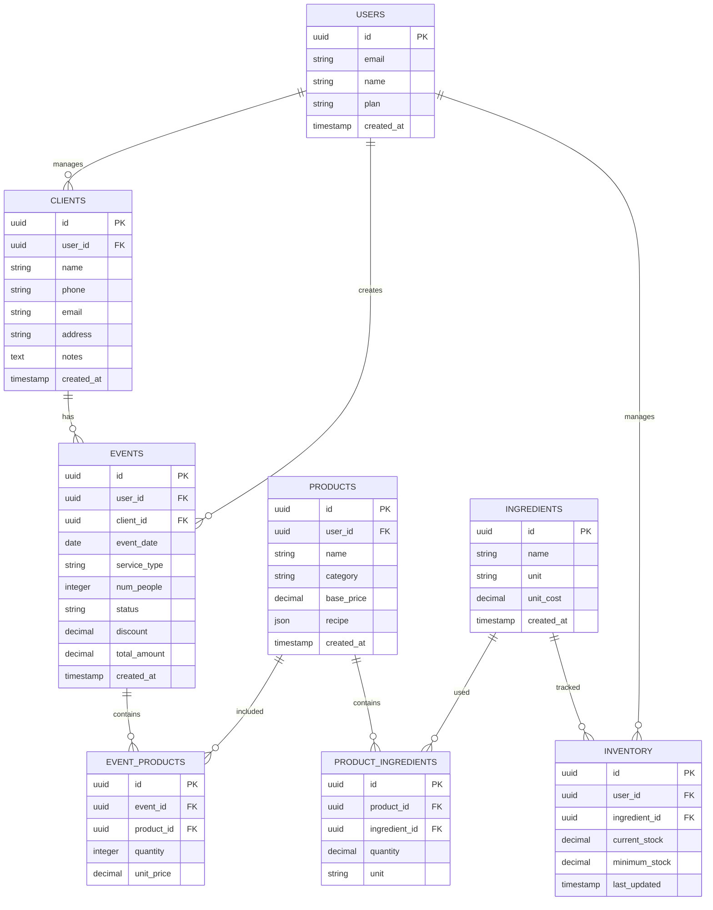

## 1. Diseño de Arquitectura



## 2. Descripción de Tecnologías

- **Frontend**: React@18 + Tailwind CSS@3 + Vite
- **Herramienta de Inicialización**: vite-init
- **Backend**: Supabase (Backend-as-a-Service)
- **Base de Datos**: PostgreSQL (integrado en Supabase)
- **Autenticación**: Supabase Auth
- **Almacenamiento**: Supabase Storage para imágenes de eventos
- **Pagos**: Stripe para suscripciones mensuales
- **Despliegue**: Vercel/Netlify para frontend, Supabase para backend

## 3. Definición de Rutas

| Ruta | Propósito |
|-------|---------|
| / | Panel principal con dashboard y métricas |
| /login | Página de inicio de sesión |
| /register | Registro de nuevos usuarios |
| /calendar | Vista de calendario con eventos |
| /clients | Lista y gestión de clientes |
| /clients/new | Crear nuevo cliente |
| /clients/:id | Detalle del cliente con historial |
| /events/new | Crear nuevo evento con calculadora |
| /events/:id | Detalle del evento y packing list |
| /inventory | Gestión de inventario y stock |
| /settings | Configuración de productos y precios |
| /subscription | Gestión de suscripción y pagos |

## 4. Definiciones de API

### 4.1 API de Clientes

```
POST /api/clients
```

Request:
| Parámetro | Tipo | Requerido | Descripción |
|-----------|-------------|-------------|-------------|
| name | string | true | Nombre del cliente |
| email | string | false | Email de contacto |
| phone | string | true | Teléfono de contacto |
| address | string | false | Dirección habitual |
| notes | string | false | Notas internas |

Response:
| Parámetro | Tipo | Descripción |
|-----------|-------------|-------------|
| id | uuid | ID único del cliente |
| total_events | number | Total de eventos del cliente |
| total_spent | number | Monto total gastado |
| last_event | date | Fecha del último evento |

### 4.2 API de Eventos

```
POST /api/events
```

Request:
| Parámetro | Tipo | Requerido | Descripción |
|-----------|-------------|-------------|-------------|
| client_id | uuid | true | ID del cliente |
| event_date | date | true | Fecha del evento |
| service_type | string | true | Tipo de servicio (churros/elotes/paletas) |
| num_people | number | true | Número de personas |
| status | string | true | Estado (quoted/confirmed/completed) |
| discount | number | false | Porcentaje de descuento |

### 4.3 API de Cálculo de Ingredientes

```
POST /api/calculate-ingredients
```

Request:
| Parámetro | Tipo | Requerido | Descripción |
|-----------|-------------|-------------|-------------|
| products | array | true | Lista de productos con cantidades |
| num_people | number | true | Número total de personas |

Response:
| Parámetro | Tipo | Descripción |
|-----------|-------------|-------------|
| ingredients | array | Lista de ingredientes con cantidades |
| total_cost | number | Costo total de ingredientes |
| cost_per_person | number | Costo por persona |
| suggested_price | number | Precio de venta sugerido |
| profit_margin | number | Margen de ganancia |

## 5. Arquitectura del Servidor



## 6. Modelo de Datos

### 6.1 Definición del Modelo de Datos



### 6.2 Lenguaje de Definición de Datos (DDL)

**Tabla de Usuarios (users)**
```sql
-- crear tabla
CREATE TABLE users (
    id UUID PRIMARY KEY DEFAULT gen_random_uuid(),
    email VARCHAR(255) UNIQUE NOT NULL,
    name VARCHAR(100) NOT NULL,
    plan VARCHAR(20) DEFAULT 'basic' CHECK (plan IN ('basic', 'premium')),
    stripe_customer_id VARCHAR(255),
    created_at TIMESTAMP WITH TIME ZONE DEFAULT NOW(),
    updated_at TIMESTAMP WITH TIME ZONE DEFAULT NOW()
);

-- crear índices
CREATE INDEX idx_users_email ON users(email);
CREATE INDEX idx_users_plan ON users(plan);
```

**Tabla de Clientes (clients)**
```sql
-- crear tabla
CREATE TABLE clients (
    id UUID PRIMARY KEY DEFAULT gen_random_uuid(),
    user_id UUID NOT NULL REFERENCES users(id) ON DELETE CASCADE,
    name VARCHAR(100) NOT NULL,
    phone VARCHAR(20) NOT NULL,
    email VARCHAR(255),
    address TEXT,
    notes TEXT,
    total_events INTEGER DEFAULT 0,
    total_spent DECIMAL(10,2) DEFAULT 0,
    created_at TIMESTAMP WITH TIME ZONE DEFAULT NOW(),
    updated_at TIMESTAMP WITH TIME ZONE DEFAULT NOW()
);

-- crear índices
CREATE INDEX idx_clients_user_id ON clients(user_id);
CREATE INDEX idx_clients_name ON clients(name);
```

**Tabla de Eventos (events)**
```sql
-- crear tabla
CREATE TABLE events (
    id UUID PRIMARY KEY DEFAULT gen_random_uuid(),
    user_id UUID NOT NULL REFERENCES users(id) ON DELETE CASCADE,
    client_id UUID NOT NULL REFERENCES clients(id) ON DELETE CASCADE,
    event_date DATE NOT NULL,
    service_type VARCHAR(50) NOT NULL,
    num_people INTEGER NOT NULL,
    status VARCHAR(20) DEFAULT 'quoted' CHECK (status IN ('quoted', 'confirmed', 'completed', 'cancelled')),
    discount DECIMAL(5,2) DEFAULT 0,
    total_amount DECIMAL(10,2) NOT NULL,
    notes TEXT,
    created_at TIMESTAMP WITH TIME ZONE DEFAULT NOW(),
    updated_at TIMESTAMP WITH TIME ZONE DEFAULT NOW()
);

-- crear índices
CREATE INDEX idx_events_user_id ON events(user_id);
CREATE INDEX idx_events_client_id ON events(client_id);
CREATE INDEX idx_events_date ON events(event_date);
CREATE INDEX idx_events_status ON events(status);
```

**Tabla de Productos (products)**
```sql
-- crear tabla
CREATE TABLE products (
    id UUID PRIMARY KEY DEFAULT gen_random_uuid(),
    user_id UUID NOT NULL REFERENCES users(id) ON DELETE CASCADE,
    name VARCHAR(100) NOT NULL,
    category VARCHAR(50) NOT NULL,
    base_price DECIMAL(10,2) NOT NULL,
    recipe JSONB,
    is_active BOOLEAN DEFAULT true,
    created_at TIMESTAMP WITH TIME ZONE DEFAULT NOW(),
    updated_at TIMESTAMP WITH TIME ZONE DEFAULT NOW()
);

-- crear índices
CREATE INDEX idx_products_user_id ON products(user_id);
CREATE INDEX idx_products_category ON products(category);
```

**Tabla de Inventario (inventory)**
```sql
-- crear tabla
CREATE TABLE inventory (
    id UUID PRIMARY KEY DEFAULT gen_random_uuid(),
    user_id UUID NOT NULL REFERENCES users(id) ON DELETE CASCADE,
    ingredient_name VARCHAR(100) NOT NULL,
    current_stock DECIMAL(10,2) NOT NULL DEFAULT 0,
    minimum_stock DECIMAL(10,2) NOT NULL DEFAULT 0,
    unit VARCHAR(20) NOT NULL,
    unit_cost DECIMAL(10,2),
    last_updated TIMESTAMP WITH TIME ZONE DEFAULT NOW()
);

-- crear índices
CREATE INDEX idx_inventory_user_id ON inventory(user_id);
CREATE INDEX idx_inventory_ingredient ON inventory(ingredient_name);
```

### Políticas de Seguridad (Row Level Security)

```sql
-- Habilitar RLS en todas las tablas
ALTER TABLE users ENABLE ROW LEVEL SECURITY;
ALTER TABLE clients ENABLE ROW LEVEL SECURITY;
ALTER TABLE events ENABLE ROW LEVEL SECURITY;
ALTER TABLE products ENABLE ROW LEVEL SECURITY;
ALTER TABLE inventory ENABLE ROW LEVEL SECURITY;

-- Políticas básicas para usuarios autenticados
CREATE POLICY "Usuarios pueden ver solo sus propios datos" ON users
    FOR ALL USING (auth.uid() = id);

CREATE POLICY "Usuarios pueden gestionar sus clientes" ON clients
    FOR ALL USING (auth.uid() = user_id);

CREATE POLICY "Usuarios pueden gestionar sus eventos" ON events
    FOR ALL USING (auth.uid() = user_id);

CREATE POLICY "Usuarios pueden gestionar sus productos" ON products
    FOR ALL USING (auth.uid() = user_id);

CREATE POLICY "Usuarios pueden gestionar su inventario" ON inventory
    FOR ALL USING (auth.uid() = user_id);
```

## 7. Consideraciones de Multi-Tenant

### Estrategia de Aislamiento
- **Aislamiento a nivel de fila**: Cada tabla tiene `user_id` para separar datos por tenant
- **Políticas de seguridad**: RLS (Row Level Security) garantiza que usuarios solo vean sus datos
- **Límites por plan**: 
  - Básico: 10 clientes, 20 eventos/mes
  - Premium: Clientes y eventos ilimitados

### Configuración de Stripe
```sql
-- Tabla de suscripciones
CREATE TABLE subscriptions (
    id UUID PRIMARY KEY DEFAULT gen_random_uuid(),
    user_id UUID NOT NULL REFERENCES users(id) ON DELETE CASCADE,
    stripe_subscription_id VARCHAR(255) UNIQUE NOT NULL,
    status VARCHAR(50) NOT NULL,
    current_period_start TIMESTAMP WITH TIME ZONE,
    current_period_end TIMESTAMP WITH TIME ZONE,
    created_at TIMESTAMP WITH TIME ZONE DEFAULT NOW(),
    updated_at TIMESTAMP WITH TIME ZONE DEFAULT NOW()
);
```

## 8. Funciones de Base de Datos

### Función para actualizar estadísticas del cliente
```sql
CREATE OR REPLACE FUNCTION update_client_stats()
RETURNS TRIGGER AS $$
BEGIN
    UPDATE clients 
    SET total_events = (
        SELECT COUNT(*) 
        FROM events 
        WHERE client_id = NEW.client_id 
        AND status = 'completed'
    ),
    total_spent = (
        SELECT COALESCE(SUM(total_amount), 0)
        FROM events 
        WHERE client_id = NEW.client_id 
        AND status = 'completed'
    ),
    updated_at = NOW()
    WHERE id = NEW.client_id;
    
    RETURN NEW;
END;
$$ LANGUAGE plpgsql;

-- Trigger para ejecutar después de completar un evento
CREATE TRIGGER trigger_update_client_stats
    AFTER UPDATE ON events
    FOR EACH ROW
    WHEN (OLD.status != 'completed' AND NEW.status = 'completed')
    EXECUTE FUNCTION update_client_stats();
```

### Función para verificar límites del plan
```sql
CREATE OR REPLACE FUNCTION check_plan_limits()
RETURNS TRIGGER AS $$
DECLARE
    user_plan VARCHAR(20);
    client_count INTEGER;
    event_count INTEGER;
BEGIN
    SELECT plan INTO user_plan FROM users WHERE id = NEW.user_id;
    
    IF user_plan = 'basic' THEN
        -- Verificar límite de clientes
        SELECT COUNT(*) INTO client_count FROM clients WHERE user_id = NEW.user_id;
        IF client_count >= 10 THEN
            RAISE EXCEPTION 'Límite de clientes alcanzado (10)';
        END IF;
        
        -- Verificar límite de eventos mensuales
        SELECT COUNT(*) INTO event_count 
        FROM events 
        WHERE user_id = NEW.user_id 
        AND DATE_TRUNC('month', created_at) = DATE_TRUNC('month', NOW());
        
        IF event_count >= 20 THEN
            RAISE EXCEPTION 'Límite de eventos mensuales alcanzado (20)';
        END IF;
    END IF;
    
    RETURN NEW;
END;
$$ LANGUAGE plpgsql;
```