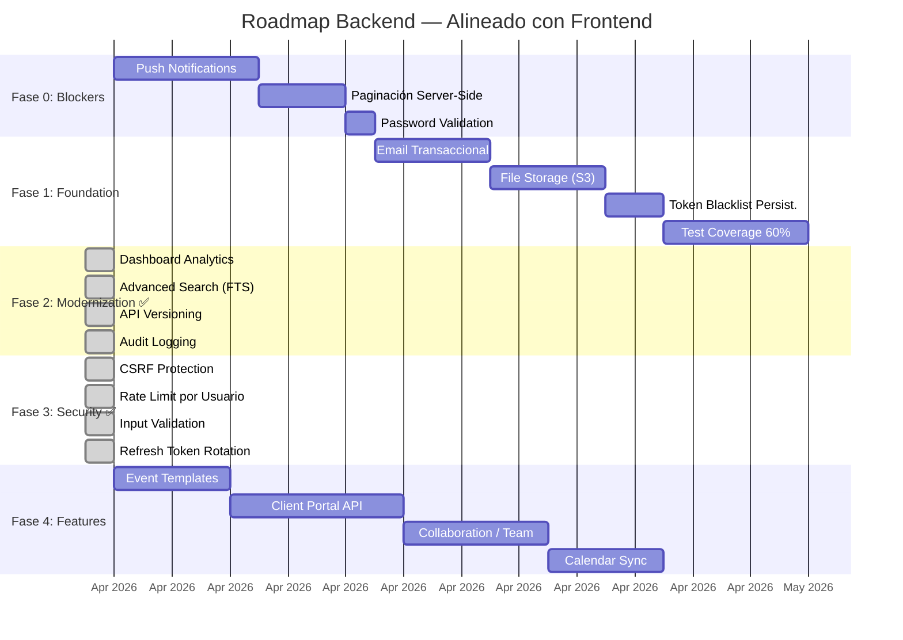

# Roadmap Backend — Alineado con Frontend

#backend #roadmap #mejoras

> [!tip] Filosofía
> Priorizado por **impacto en usuario** × **esfuerzo técnico**. Alineado con [[Roadmap Web]], [[Roadmap Android]] y [[Roadmap iOS]]. Cada fase deja la API en un estado shippable mejor que el anterior.

---

## Estado Actual del Backend vs Frontend

| Capacidad | Backend | Web | iOS | Android | Gap |
|-----------|---------|-----|-----|---------|-----|
| CRUD básico (6 dominios) | ✅ | ✅ | ✅ | ✅ | — |
| Auth multi-provider | ✅ | ✅ | ✅ | ✅ | — |
| Event photos | ✅ | ✅ | ✅ | ✅ | — |
| Equipment conflicts | ✅ | ✅ | ✅ | ✅ | — |
| Equipment/supply suggestions | ✅ | ✅ | ✅ | ✅ | — |
| Stripe subscriptions (web) | ✅ | ✅ | — | — | — |
| RevenueCat (mobile) | ✅ | — | ✅ | ✅ | — |
| Push notifications | ✅ FCM+APNs | ✅ FCM | ✅ APNs | ✅ FCM | — |
| Paginación | ✅ Server | ✅ Server | ✅ Server | ✅ Server | — |
| Email transaccional | ⚠️ Solo reset | ✅ | ✅ | ✅ | **P1** |
| File storage | ⚠️ Local | ✅ | ✅ | ✅ | **P1** |
| Dashboard analytics | ✅ Server-side | ✅ KPIs | ✅ KPIs | ✅ KPIs | — |
| API versioning | ✅ v1 + legacy | — | — | — | — |
| Audit logging | ✅ Middleware | — | — | — | — |
| Background jobs | ⚠️ 1 job | — | — | — | **P2** |

---

## Fase 0: Blockers Críticos (Pre-Release)

> [!success] Impacto: Crítico | Esfuerzo: Medio
> Sin esto, la plataforma NO está lista para usuarios en producción.

### 0.1 Push Notifications (Envío Activo) ✅

- [x] Integrar FCM (Firebase Cloud Messaging) para Android + Web
- [x] Integrar APNs (Apple Push Notification service) para iOS
- [x] Crear `services/push_service.go` con envío por plataforma
- [x] Crear `services/notification_service.go` con templates de notificación
- [x] Notificaciones de evento próximo (24h, 1h antes)
- [x] Notificaciones de pago pendiente
- [x] Notificaciones de cotización sin confirmar (push + email, dedupe vía notification_log)
- [x] Batch sending (no una por una)
- [x] Manejo de tokens inválidos (limpieza automática)

**Por qué**: Device tokens se registran pero NADA se envía. El frontend iOS/Android/Web tienen stubs esperando esto. Es la brecha P1 más crítica. Ver [[Roadmap iOS]] Fase 2.1 y [[Roadmap Android]] Fase 2.1.

### 0.2 Paginación Server-Side ✅

- [x] Agregar `?page=1&limit=20&sort=created_at&order=desc` a todos los list endpoints
- [x] `GET /api/events?page=1&limit=20`
- [x] `GET /api/clients?page=1&limit=20`
- [x] `GET /api/products?page=1&limit=20`
- [x] `GET /api/inventory?page=1&limit=20`
- [x] `GET /api/payments?page=1&limit=20`
- [x] Response: `{ data: [], total: N, page: 1, limit: 20, total_pages: N }`
- [ ] ~~Cursor-based pagination como alternativa para eventos (por fecha)~~ — **Diferido**: offset alcanza para los volúmenes actuales; reevaluar si crece el dataset

**Por qué**: Sin paginación, `GET /api/events` retorna TODOS los eventos. Con cientos de eventos, las respuestas serán enormes. El frontend ya maneja paginación client-side, pero la carga inicial crece con el tiempo.

### 0.3 Password Validation en Backend ✅ (ya existía)

- [x] Validar mínimo 8 caracteres en registro
- [x] Validar complejidad (al menos 1 mayúscula, 1 número)
- [x] Retornar error descriptivo

**Por qué**: Seguridad básica. Actualmente solo el frontend valida. Un API client directo puede registrar passwords de 1 carácter.

---

## Fase 1: Foundation (Estabilidad y Robustez)

> [!success] Impacto: Alto | Esfuerzo: Medio
> Base sólida para crecimiento.

### 1.1 Email Transaccional Completo ✅

- [x] Welcome email al registrarse (onboarding)
- [x] Event reminder (24h antes)
- [x] Payment receipt email
- [x] Quotation received notification (`SendQuotationReceived`)
- [x] Subscription confirmation/renewal
- [x] Template system con variables (reemplazar hardcoded HTML)

**Por qué**: Solo existe reset de password. El organizador necesita comunicación automatizada con clientes. Ver [[Roadmap Web]] Fase 5.4 (Portal de Cliente).

### 1.2 File Storage Migration (S3/Cloud Storage) ✅

- [x] Abstraer storage interface (`StorageProvider`)
- [x] Implementar `LocalStorage` (actual) y `S3Storage`
- [x] Configurar via `STORAGE_PROVIDER=local|s3`
- [ ] Presigned URLs para uploads directos
- [ ] CDN para serving de imágenes
- [x] Image resize en upload (thumbnails como ahora, pero en S3)

**Por qué**: El storage local no funciona con múltiples instancias. Para producción escalable, S3/Cloud Storage es esencial. Ver nota en `upload_handler.go`.

### 1.3 Token Blacklist Persistente ✅

- [x] Crear tabla `revoked_tokens(id, token_hash, expires_at, revoked_at)`
- [x] Reemplazar `sync.Map` con query a DB
- [x] Cleanup automático de tokens expirados
- [ ] Alternativa: Redis con TTL automático

**Por qué**: Blacklist en memoria se pierde al reiniciar. Tokens revocados por logout funcionan nuevamente post-restart.

### 1.4 Test Coverage Mínimo ✅ (parcial)

- [x] Target: 60% coverage en handlers — **70.1% alcanzado** (2026-04-06)
- [x] Tests para todos los CRUD flows (happy + error paths)
- [ ] Integration tests con testcontainers (PostgreSQL real en CI) — futuro
- [ ] Benchmark tests para endpoints críticos — futuro
- [ ] Tests para concurrent access scenarios — futuro

**Coverage actual**: middleware 95.8%, router 92.3%, handlers 70.1%, services 55.5%, storage 49%, repository 31.8%

**Por qué**: Sin tests, cada cambio es un riesgo. La base de tests actual es buena pero no cubre todos los edge cases.

---

## Fase 2: API Modernization ✅

> [!done] FASE 2 COMPLETADA — 2026-04-06
> Dashboard analytics, FTS, API versioning y audit logging implementados. Todos los tests pasan.

### 2.1 Dashboard Analytics Endpoints ✅

- [x] `GET /api/v1/dashboard/kpis` — KPIs calculados server-side (revenue, eventos mes, stock bajo, cotizaciones pendientes, upcoming events, total clients, avg event value)
- [x] `GET /api/v1/dashboard/revenue-chart?period=month|quarter|year` — Revenue por mes (últimos 12 meses por defecto)
- [x] `GET /api/v1/dashboard/events-by-status` — Distribución de estados
- [x] `GET /api/v1/dashboard/top-clients?limit=10` — Top clientes por gasto
- [x] `GET /api/v1/dashboard/product-demand` — Productos más vendidos (top 10 desde event_products)
- [x] `GET /api/v1/dashboard/forecast` — Forecast basado en eventos confirmados/cotizados futuros
- [x] `GET /api/v1/dashboard/activity?page=1&limit=20` — Activity log del usuario (audit trail)

**Archivos**: `repository/dashboard_repo.go`, `handlers/dashboard_handler.go`

**Por qué**: Alineado con [[Roadmap Web]] Fase 5.1 y [[Roadmap Android]] Fase 5.1. El dashboard actual calcula todo client-side con datos raw. Con más datos, necesita server-side aggregation.

### 2.2 Advanced Search ✅

- [x] Full-text search con PostgreSQL GIN indexes + `pg_trgm` (migración 033)
- [x] Fuzzy matching con `similarity()` > 0.3 en clients, events, products, inventory
- [x] Resultados ordenados por score de similaridad
- [x] Filtros combinables: `GET /api/v1/events/search?q=text&status=confirmed&from=2026-01-01&to=2026-12-31&client_id=uuid`
- [ ] Search highlighting en resultados (futuro)

**Archivos**: `migrations/033_add_fulltext_search.up.sql`, `event_repo.go` (SearchEventsAdvanced), `crud_handler.go` (SearchEvents), 4 repos actualizados con similarity()

**Por qué**: Alineado con [[Roadmap Web]] Fase 2.3. ILIKE no escala. Full-text search es nativo en PostgreSQL.

### 2.3 API Versioning ✅

- [x] Prefix rutas con `/api/v1/...` (canonical)
- [x] Mantener `/api/...` como alias (backward compatible via Chi Mount)
- [x] Header `X-API-Version: v1` en todas las respuestas API
- [ ] Header `Accept: application/vnd.solennix.v1+json` (futuro, cuando haya v2)
- [ ] Documentación de breaking changes entre versiones (futuro)

**Archivos**: `router/router.go` (refactored to chi.NewRouter + Mount), `middleware/version.go`

**Por qué**: Sin versioning, cualquier cambio breaking afecta todos los clientes (Web, iOS, Android) simultáneamente.

### 2.4 Audit Logging ✅

- [x] Tabla `audit_logs(id, user_id, action, resource_type, resource_id, details JSONB, ip_address, user_agent, created_at)` (migración 034)
- [x] Middleware async que registra POST, PUT, DELETE exitosos en goroutine
- [x] `GET /api/v1/dashboard/activity` — Activity log del usuario autenticado (paginado)
- [x] `GET /api/v1/admin/audit-logs` — Todos los audit logs (admin only, paginado)
- [ ] Exportar logs para compliance (futuro)

**Archivos**: `migrations/034_add_audit_logs.up.sql`, `repository/audit_repo.go`, `middleware/audit.go`, `handlers/audit_handler.go`

**Por qué**: Alineado con [[Roadmap Web]] Fase 5.3 (Colaboración). Sin audit log, no hay manera de saber quién hizo qué.

---

## Fase 3: Security Hardening ✅

> [!done] FASE 3 COMPLETADA — 2026-04-06
> CSRF, rate limiting por usuario, validación mejorada y refresh token rotation implementados. Todos los tests pasan.

### 3.1 CSRF Protection ✅

- [x] Double-submit cookie pattern (`csrf_token` cookie, NOT httpOnly, SameSite=Strict)
- [x] Validación `X-CSRF-Token` header en POST/PUT/DELETE
- [x] Skip para Bearer auth (mobile/API clients)
- [x] Skip para webhooks (verificados por firma)
- [x] Skip para auth routes (públicos, sin sesión)
- [x] Skip si no hay `auth_token` cookie (sin sesión web que proteger)

**Archivos**: `middleware/csrf.go`, `middleware/csrf_test.go`

**Por qué**: Cookie-based auth es vulnerable a CSRF sin protección.

### 3.2 Rate Limiting por Usuario ✅

- [x] Rate limit por `userID` autenticado (básico: 60, pro: 200, premium: 500 req/min)
- [x] `CachedPlanResolver` con sync.Map cache (TTL 5 min, evita hit DB por request)
- [x] Headers `X-RateLimit-Limit`, `X-RateLimit-Remaining`, `Retry-After`
- [x] `GetPlanByID` en UserRepo (query optimizada, solo columna plan)
- [ ] Redis-backed para multi-instancia (futuro, cuando haya horizontal scaling)

**Archivos**: `middleware/user_ratelimit.go`, `middleware/plan_resolver.go`, `repository/user_repo.go`

### 3.3 Input Validation Mejorado ✅

- [x] Middleware `ValidateUUID("id", "photoId")` en rutas protegidas y admin
- [x] Constantes de largo máximo: name(255), description(2000), notes(5000), address(500), etc.
- [x] `sanitizeString()` / `sanitizeOptionalString()` con `html.EscapeString` (XSS prevention)
- [x] Validación de largo en ValidateClient, ValidateEvent, ValidateProduct, ValidateInventoryItem
- [x] Validación de enum `payment_method` (cash/transfer/card/check/other)
- [x] File type verification via magic bytes (ya existía en upload_handler.go)

**Archivos**: `middleware/validate_uuid.go`, `handlers/validation.go` (extendido)

### 3.4 Refresh Token Rotation ✅

- [x] Tabla `refresh_token_families` con `family_id`, `token_hash`, `used` flag (migración 035)
- [x] Al hacer refresh: consume token anterior (mark used), genera nuevo par con mismo family
- [x] Detección de reuso: si un token `used=true` se presenta → revoca toda la familia
- [x] Login/Register/OAuth almacenan refresh token inicial en la familia
- [x] Logout/ChangePassword/ResetPassword revocan todas las familias del usuario
- [x] Cleanup de tokens expirados en background job existente
- [x] Backward compatible: si `refreshTokenRepo` es nil, usa comportamiento anterior

**Archivos**: `migrations/035_add_refresh_token_families.up.sql`, `repository/refresh_token_repo.go`, `services/auth_service.go` (FamilyID en claims), `handlers/auth_handler.go` (rotation logic)

---

## Fase 3.5: iOS Live Activity Push-to-Update ✅

> [!done] Implementado 2026-04-06
> Backend ahora puede empujar actualizaciones de estado a Live Activities iOS corriendo en el dispositivo del usuario, vía APNs `liveactivity` push type. La Dynamic Island refleja cambios cuando otro dispositivo o miembro del equipo modifica el evento.

- [x] Migración 036: tabla `live_activity_tokens (id, user_id, event_id, push_token, created_at, expires_at)` con `UNIQUE(event_id, push_token)`
- [x] `repository/live_activity_token_repo.go` — Register (upsert), GetByEventID, DeleteByEventID, DeleteByToken
- [x] `services/live_activity_service.go` — `PushUpdate` y `PushEnd` con headers correctos: `apns-push-type: liveactivity`, topic `{bundleID}.push-type.liveactivity`, priority high. Limpia tokens muertos (BadDeviceToken/Unregistered/ExpiredToken) automáticamente. Reusa el `apns2.Client` ya inicializado en `PushService`.
- [x] `handlers/live_activity_handler.go` — `POST /api/v1/live-activities/register` y `DELETE /api/v1/live-activities/by-event/{eventId}`
- [x] Hook en `crud_handler.UpdateEvent` — cuando `existing.Status != oldStatus`, llama `liveActivitySvc.PushUpdate` con `DeriveContentStateFromStatus` mapeando confirmed→setup, completed→completed, cancelled→completed, otros→in_progress
- [x] `LiveActivityContentState` con field tags JSON camelCase (`startTime`, `elapsedMinutes`, `statusLabel`) que matchean exactamente la decodificación de iOS `SolennixEventAttributes.ContentState`

**Archivos**: `migrations/036_add_live_activity_tokens.{up,down}.sql`, `models/models.go` (LiveActivityToken), `repository/live_activity_token_repo.go`, `services/live_activity_service.go`, `handlers/live_activity_handler.go`, `cmd/server/main.go` (wiring), `internal/router/router.go` (rutas)

---

## Fase 4: Features Avanzadas (Alineado con Frontend)

> [!success] Impacto: Alto | Esfuerzo: Alto
> Features que el frontend ya planea o tiene parcialmente.

### 4.1 Event Templates (Plantillas)

- [ ] `POST /api/events/{id}/save-as-template` — Guardar evento como plantilla
- [ ] `GET /api/templates` — Listar plantillas del usuario
- [ ] `POST /api/events/from-template/{templateId}` — Crear evento desde plantilla
- [ ] Tabla `event_templates` con productos, extras, equipo, insumos pre-configurados

**Por qué**: Alineado con [[Roadmap Web]] Fase 5.5, [[Roadmap Android]] Fase 5.2, [[Roadmap iOS]] Fase 5.2. Reduce trabajo repetitivo enormemente.

### 4.2 Client Portal API

- [ ] `GET /api/public/events/{token}` — Vista pública del evento (sin auth)
- [ ] `POST /api/public/events/{token}/approve` — Cliente aprueba cotización
- [ ] `POST /api/public/events/{token}/sign-contract` — Firma digital
- [ ] `POST /api/public/events/{token}/pay` — Pago directo del cliente
- [ ] Tokens de acceso único con expiración

**Por qué**: Alineado con [[Roadmap Web]] Fase 5.4. El frontend necesita endpoints públicos para el portal de cliente.

### 4.3 Collaboration / Team

- [ ] Tabla `team_members(id, user_id, invited_email, role, status)`
- [ ] `POST /api/team/invite` — Invitar miembro
- [ ] `PUT /api/team/{id}/role` — Cambiar rol
- [ ] Multi-tenant por equipo (no solo por usuario individual)
- [ ] Row-level security por team

**Por qué**: Alineado con [[Roadmap Web]] Fase 5.3, [[Roadmap Android]] Fase 5.4, [[Roadmap iOS]] Fase 5.4.

### 4.4 Calendar Sync API

- [ ] `GET /api/calendar/ical` — Exportar eventos como iCal feed
- [ ] `GET /api/calendar/google-auth` — OAuth para Google Calendar
- [ ] `POST /api/calendar/sync` — Sincronizar eventos con Google Calendar
- [ ] Webhook para recibir updates de Google Calendar

**Por qué**: Alineado con [[Roadmap Android]] Fase 5.6 y [[Roadmap iOS]] Fase 5.5.

---

## Prioridad Visual

---

## Quick Wins (< 1 día cada uno)

> [!tip] Victorias rápidas para hacer ya

- [x] Agregar `?page=1&limit=20` básico en `GET /api/events`
- [x] Validar password length >= 8 en `POST /api/auth/register`
- [x] Agregar índice `idx_events_user_date` en events
- [x] Agregar `GET /api/health` que verifique DB connection (no solo HTTP)
- [x] Agregar `X-Request-ID` header para tracing
- [x] Rate limiting en `POST /api/auth/register` separado de login (3 req / 15 min)
- [x] Agregar `Content-Type` validation en upload handler
- [x] Log user_id en todas las requests autenticadas (Logger middleware extendido)
- [x] Timeout en queries SQL via context (`middleware/timeout.go` — 30s, skip uploads)

---

## Cross-Platform Requirements (Lo que el frontend NECESITA del backend)

> [!danger] Requirements del frontend que el backend NO provee aún

| Feature | Frontend necesita | Backend estado | Esfuerzo |
|---------|-------------------|----------------|----------|
| **Paginación** | `?page&limit` en todos los list | ✅ Implementado | — |
| **Push notifications** | Envío real de notificaciones | ✅ FCM + APNs | — |
| **Dashboard KPIs** | Server-side aggregation | ✅ 6 endpoints + activity | — |
| **Plantillas de evento** | CRUD de templates | ❌ No existe | 3-4 días |
| **Portal de cliente** | Endpoints públicos con token | ❌ No existe | 5-6 días |
| **Email transaccional** | Welcome, reminder, receipt | ⚠️ Solo reset | 3-4 días |
| **File storage escalable** | S3/CDN para imágenes | ⚠️ Local disk | 2-3 días |
| **Advanced search** | FTS con filtros combinables | ✅ pg_trgm + GIN | — |
| **Audit log** | Activity tracking | ✅ Middleware async | — |
| **iCal feed** | Calendar export URL | ❌ No existe | 1-2 días |
| **Webhooks outgoing** | Notificar a servicios externos | ❌ No existe | 2-3 días |
| **Bulk operations** | Delete múltiple, status change batch | ❌ No existe | 2-3 días |

---

## Relaciones

- [[Backend MOC]] — Hub principal
- [[Seguridad]] — Mejoras de seguridad detalladas
- [[Performance]] — Áreas de mejora de rendimiento
- [[Testing]] — Estado actual de tests
