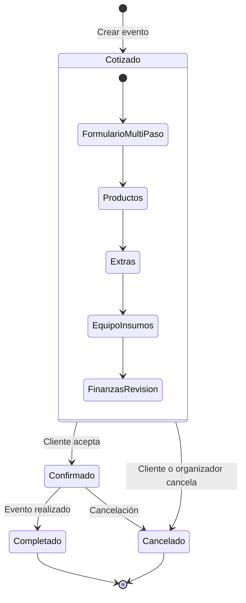

---
tags:
  - prd
  - features
  - paridad
  - solennix
aliases:
  - Catálogo de Features
  - Features
date: 2026-03-20
updated: 2026-04-17
status: active
---

# Solennix — Documento Unificado de Features

**Version:** 1.2
**Fecha:** 2026-04-17 (post Sprint 7.A + Portal Cliente MVP + Personal/Colaboradores Phase 1)
**Plataformas:** iOS (iPhone/iPad), Android (Phone/Tablet), Web (React SPA), Backend (Go/PostgreSQL)
**Autor:** Tiago David + Claude Code
**Estado:** Borrador

> [!tip] Documentos relacionados
>
> - [[01_PRODUCT_VISION|Visión]] — Objetivos, usuarios objetivo, propuesta de valor
> - [[04_MONETIZATION|Monetización]] — Tiers, precios y feature gating
> - [[11_CURRENT_STATUS|Estado Actual]] — Progreso de implementación y brechas

---

## Convenciones de Etiquetas

> [!info] Leyenda de etiquetas y estados
> Estas etiquetas se usan consistentemente en todo el documento para indicar alcance de plataforma y estado de implementación.

| Etiqueta      | Significado                                                              |
| ------------- | ------------------------------------------------------------------------ |
| **[Todas]**   | Feature compartida en todas las plataformas (iOS, Android, Web, Backend) |
| **[iOS]**     | Exclusiva de iOS (iPhone, iPad)                                          |
| **[Android]** | Exclusiva de Android (Phone, Tablet)                                     |
| **[Web]**     | Exclusiva de la aplicacion web (React)                                   |
| **[Backend]** | Exclusiva del servidor (Go API)                                          |
| **[Mobile]**  | Compartida entre iOS y Android                                           |

### Estados de implementacion

| Simbolo | Estado       |
| ------- | ------------ |
| ✅      | Implementado |
| 🔄      | En progreso  |
| ⬜      | Pendiente    |
| 📋      | Idea en exploración (no comprometida) |
| ➖      | No aplica    |

---

## Ciclo de Vida de un Evento

---

## P0 — Must-Have (Obligatorio)

### 1. Gestion de Eventos [Todas]

> [!abstract] Resumen
> El modulo central de Solennix. Permite a organizadores de eventos crear, cotizar, confirmar y gestionar eventos completos con productos, equipo, insumos, precios y galeria de fotos.

#### Formulario multi-paso

El formulario de creacion/edicion de eventos esta dividido en pasos para reducir la carga cognitiva:

| Paso | Nombre              | Contenido                                                                                                 | Plataforma |
| ---- | ------------------- | --------------------------------------------------------------------------------------------------------- | ---------- |
| 1    | Informacion General | Cliente, fecha, horario, tipo de servicio, num. personas, status, ubicacion, ciudad                       | [Todas]    |
| 2    | Productos           | Seleccion de productos del catalogo, cantidad, precio unitario, descuento por producto                    | [Todas]    |
| 3    | Extras              | Cargos adicionales con descripcion, costo, precio y opcion de excluir utilidad                            | [Todas]    |
| 4    | Equipo e Insumos    | Equipo asignado con deteccion de conflictos + insumos con fuente (stock/compra) y opcion de excluir costo | [Todas]    |
| 5    | Finanzas y Revision | Subtotal, descuento global (% o fijo), IVA, total, deposito, condiciones de cancelacion, notas            | [Todas]    |

> [!note] Notas por plataforma
>
> - **[iOS]**: `EventFormView` con SwiftUI, navegacion por `TabView` o stepper. Steps en `EventFormSteps/Step1GeneralView.swift` a `Step5FinancesView.swift`.
> - **[Android]**: `EventFormScreen.kt` con Jetpack Compose, formulario multi-paso con `HorizontalPager` o stepper manual.
> - **[Web]**: Componentes separados: `EventGeneralInfo.tsx`, `EventProducts.tsx`, `EventExtras.tsx`, `EventEquipment.tsx`, `EventSupplies.tsx`, `EventFinancials.tsx`, `Payments.tsx`.

#### Estados del evento

| Estado       | Descripcion                                             |
| ------------ | ------------------------------------------------------- |
| `cotizado`   | Propuesta enviada al cliente, pendiente de confirmacion |
| `confirmado` | Cliente acepto, evento programado                       |
| `completado` | Evento realizado exitosamente                           |
| `cancelado`  | Evento cancelado por el cliente o el organizador        |

#### Pricing con IVA y descuentos

- **Descuento global**: Porcentaje (`discount_type: 'percent'`) o monto fijo (`discount_type: 'fixed'`).
- **IVA configurable**: `tax_rate` y `tax_amount` calculados. Facturacion opcional (`requires_invoice`).
- **Deposito**: Porcentaje configurable (`deposit_percent`) heredado de la configuracion del negocio o personalizado por evento.
- **Condiciones de cancelacion**: Dias de anticipacion (`cancellation_days`) y porcentaje de reembolso (`refund_percent`).

#### Galeria de fotos del evento

- Subida de imagenes individuales por evento (endpoint `POST /api/events/{id}/photos`).
- Listado de fotos con URL y thumbnail (`GET /api/events/{id}/photos`).
- Eliminacion individual (`DELETE /api/events/{id}/photos/{photoId}`).
- **[Mobile]**: Seleccion desde camara o galeria del dispositivo.
- **[Web]**: Upload con drag-and-drop o selector de archivos.

#### Deteccion de conflictos de equipo

Cuando se asigna equipo a un evento, el sistema verifica automaticamente si ese equipo ya esta reservado para otro evento en la misma fecha:

- **Endpoint**: `POST /api/events/equipment/conflicts` (Web, JSON body) / `GET /api/events/equipment/conflicts` (Mobile, query params).
- Retorna lista de `EquipmentConflict` con: nombre del equipo, evento conflictivo, fecha, horario, tipo de servicio, nombre del cliente.
- Tipos de conflicto detectados: solapamiento completo o parcial de horarios.

#### Sugerencias de equipo e insumos

Basado en los productos seleccionados y sus recetas (ingredientes), el sistema sugiere automaticamente:

- **Equipo sugerido**: `GET/POST /api/events/equipment/suggestions` — calcula cantidad necesaria usando `ceil(product_qty / capacity)` si el equipo tiene capacidad definida, o `quantity_required` directo.
- **Insumos sugeridos**: `GET/POST /api/events/supplies/suggestions` — suma `quantity_required` de todos los productos que usan ese insumo.
- Los insumos incluyen `unit_cost` para estimar costos de compra.

**Tier:** FREE (hasta limite de plan) / BASIC / PRO (ilimitado) — ver [[04_MONETIZATION|Monetización]]

> [!tip] Documentos relacionados
>
> - [[05_TECHNICAL_ARCHITECTURE_IOS|Arq. iOS]] — Estructura de paquetes SPM para eventos
> - [[06_TECHNICAL_ARCHITECTURE_ANDROID|Arq. Android]] — Módulo feature/event
> - [[08_TECHNICAL_ARCHITECTURE_WEB|Arq. Web]] — Componentes de evento en React
> - [[07_TECHNICAL_ARCHITECTURE_BACKEND|Arq. Backend]] — Handlers y repositorios de eventos

---

### 2. Gestion de Clientes [Todas]

> [!abstract] Resumen
> CRUD completo de clientes con informacion de contacto y metricas acumuladas.

#### Campos del cliente

| Campo       | Tipo   | Requerido |
| ----------- | ------ | --------- |
| `name`      | string | Si        |
| `phone`     | string | Si        |
| `email`     | string | No        |
| `address`   | string | No        |
| `city`      | string | No        |
| `notes`     | string | No        |
| `photo_url` | string | No        |

#### Metricas calculadas

- **`total_events`**: Conteo de eventos asociados al cliente.
- **`total_spent`**: Suma acumulada de los montos totales de sus eventos.

#### Funcionalidades

| Feature       | Detalle                                                                |
| ------------- | ---------------------------------------------------------------------- |
| CRUD completo | Crear, leer, actualizar, eliminar clientes                             |
| Busqueda      | Filtrado por nombre, telefono, email                                   |
| Historial     | Vista de eventos asociados y gasto total                               |
| Quick Client  | Creacion rapida de cliente desde el formulario de evento (sheet/modal) |

**Implementacion Quick Client:**

- **[iOS]**: `QuickClientSheet.swift` — sheet presentado desde Step 1 del formulario de evento.
- **[Web]**: `QuickClientModal.tsx` — modal con formulario minimo (nombre + telefono).
- **[Android]**: Dialog integrado en `EventFormScreen.kt`.

**Endpoints Backend:**

- `GET /api/clients` — listar
- `POST /api/clients` — crear
- `GET /api/clients/{id}` — detalle
- `PUT /api/clients/{id}` — actualizar
- `DELETE /api/clients/{id}` — eliminar

**Tier:** FREE (hasta limite de plan) / BASIC / PRO (ilimitado) — ver [[04_MONETIZATION|Monetización]]

---

### 3. Catalogo de Productos [Todas]

> [!abstract] Resumen
> Gestion del catalogo de productos/servicios que el organizador ofrece en sus eventos.

#### Campos del producto

| Campo        | Tipo    | Descripcion                            |
| ------------ | ------- | -------------------------------------- |
| `name`       | string  | Nombre del producto                    |
| `category`   | string  | Categoria (ej. "Bebidas", "Postres")   |
| `base_price` | float64 | Precio base de venta                   |
| `recipe`     | JSON    | Receta con ingredientes del inventario |
| `image_url`  | string  | Imagen del producto                    |
| `is_active`  | bool    | Si esta activo en el catalogo          |

#### Recetas e ingredientes

Cada producto puede tener una receta que vincula items del inventario como ingredientes:

| Campo               | Descripcion                                                                      |
| ------------------- | -------------------------------------------------------------------------------- |
| `inventory_id`      | Referencia al item de inventario                                                 |
| `quantity_required` | Cantidad necesaria por unidad de producto                                        |
| `capacity`          | Para equipo: cuantas unidades de producto maneja una pieza (nil = cantidad fija) |
| `bring_to_event`    | Si este ingrediente debe transportarse al lugar del evento                       |

**Endpoints Backend:**

- `GET/POST /api/products` — listar/crear
- `GET/PUT/DELETE /api/products/{id}` — detalle/actualizar/eliminar
- `GET/PUT /api/products/{id}/ingredients` — ingredientes de la receta
- `POST /api/products/ingredients/batch` — ingredientes en lote (para multiples productos)

**Vistas por plataforma:**

- **[iOS]**: `ProductListView`, `ProductDetailView`, `ProductFormView`
- **[Android]**: `ProductListScreen`, `ProductDetailScreen`, `ProductFormScreen`
- **[Web]**: `ProductList`, `ProductForm`, `ProductDetails`

**Tier:** FREE (hasta limite de plan) / BASIC / PRO (ilimitado) — ver [[04_MONETIZATION|Monetización]]

---

### 4. Inventario [Todas]

> [!abstract] Resumen
> Gestion de equipos e insumos necesarios para los eventos.

#### Campos del item de inventario

| Campo             | Tipo    | Descripcion                                                             |
| ----------------- | ------- | ----------------------------------------------------------------------- |
| `ingredient_name` | string  | Nombre del item                                                         |
| `type`            | string  | `'equipment'` (equipo) o `'supply'` (insumo)                            |
| `current_stock`   | float64 | Stock actual                                                            |
| `minimum_stock`   | float64 | Stock minimo para alertas (si es `0`, no dispara alerta por stock bajo) |
| `unit`            | string  | Unidad de medida (kg, piezas, litros, etc.)                             |
| `unit_cost`       | float64 | Costo por unidad (opcional)                                             |

#### Diferencias entre tipos

| Aspecto          | Equipo (`equipment`)                     | Insumo (`supply`)                                  |
| ---------------- | ---------------------------------------- | -------------------------------------------------- |
| Ejemplo          | Sillas, mesas, manteles                  | Harina, servilletas, decoracion                    |
| Uso              | Se reserva para eventos, reutilizable    | Se consume, no reutilizable                        |
| Conflictos       | Si (deteccion de conflictos por fecha)   | No                                                 |
| Capacidad        | Si (cuantas unidades de producto maneja) | No aplica                                          |
| Costo en evento  | No se suma al costo del evento           | Se suma (salvo `exclude_cost: true`)               |
| Fuente en evento | N/A                                      | `'stock'` (del inventario) o `'purchase'` (compra) |

**Endpoints Backend:**

- `GET/POST /api/inventory` — listar/crear
- `GET/PUT/DELETE /api/inventory/{id}` — detalle/actualizar/eliminar

**Vistas por plataforma:**

- **[iOS]**: `InventoryListView`, `InventoryDetailView`, `InventoryFormView`
- **[Android]**: `InventoryListScreen`, `InventoryDetailScreen`, `InventoryFormScreen`
- **[Web]**: `InventoryList`, `InventoryForm`, `InventoryDetails`

**Tier:** FREE (hasta limite de plan) / BASIC / PRO (ilimitado) — ver [[04_MONETIZATION|Monetización]]

---

### 5. Calendario [Todas]

> [!abstract] Resumen
> Vista mensual de eventos enfocada en visualizacion y gestion de disponibilidad. El Calendario NO incluye vista de lista de eventos — esa funcionalidad vive en la seccion Eventos (ver seccion 1).

#### Funcionalidades

| Feature                     | Detalle                                                                                                                               |
| --------------------------- | ------------------------------------------------------------------------------------------------------------------------------------- |
| Vista mensual (unica vista) | Grid de calendario con indicadores de eventos por dia. No hay vista lista — se elimino para evitar duplicacion con la seccion Eventos |
| Navegacion por mes          | Botones/gestos para avanzar y retroceder meses                                                                                        |
| Indicadores de eventos      | Dots de colores por status: gris (cotizado), azul (confirmado), verde (completado), rojo (cancelado). Max 3 dots por dia              |
| Fechas no disponibles       | Long-press para bloquear/desbloquear rapido + boton "Gestionar Bloqueos" para ver/editar todos los bloqueos                           |
| Tap en dia                  | Muestra eventos de ese dia en panel inferior (phone) o panel lateral (tablet/desktop)                                                 |
| Panel de dia seleccionado   | Muestra event cards con tipo de servicio, hora, cliente, status badge. Tap en card → detalle del evento                               |

#### Toolbar del Calendario

| Elemento                   | Descripcion                                                                    |
| -------------------------- | ------------------------------------------------------------------------------ |
| Titulo                     | "Calendario" (unificado en todas las plataformas)                              |
| Boton "Gestionar Bloqueos" | Abre panel/modal con lista de todos los bloqueos, opcion de agregar y eliminar |
| Boton "Hoy"                | Navega al mes actual y selecciona la fecha de hoy                              |

**Removidos del toolbar:** ~~Toggle vista calendario/lista~~, ~~Boton crear evento~~ (ahora en FAB), ~~Boton Quick Quote~~ (ahora en FAB), ~~Boton exportar CSV~~ (movido a seccion Eventos), ~~Boton busqueda~~ (ahora en topbar global).

#### Bloqueo de fechas

**Interaccion rapida (long-press):**

- Long-press en fecha NO bloqueada → dialogo "Bloquear Fecha" con fecha inicio, fecha fin (opcional, para rangos), razon (opcional)
- Long-press en fecha BLOQUEADA → dialogo con info del bloqueo + boton "Desbloquear"
- Web: right-click (onContextMenu) en vez de long-press

**Gestion centralizada (boton toolbar):**

- Lista de todos los bloqueos activos con rango de fechas, razon, boton eliminar
- Boton "Agregar Bloqueo" con formulario fecha inicio + fecha fin + razon
- Implementacion: Sheet (iOS), BottomSheet (Android), Modal (Web)

#### Fechas no disponibles (Blackout Dates)

| Campo        | Tipo   | Descripcion                   |
| ------------ | ------ | ----------------------------- |
| `start_date` | DATE   | Fecha de inicio del bloqueo   |
| `end_date`   | DATE   | Fecha de fin del bloqueo      |
| `reason`     | string | Motivo del bloqueo (opcional) |

**Endpoints Backend:**

- `GET /api/unavailable-dates` — listar
- `POST /api/unavailable-dates` — crear
- `DELETE /api/unavailable-dates/{id}` — eliminar

#### Layout por form factor

| Form Factor                         | Layout                                                                                     |
| ----------------------------------- | ------------------------------------------------------------------------------------------ |
| iPhone / Android Phone / Web Mobile | Scroll vertical: calendario arriba, eventos del dia seleccionado abajo                     |
| iPad / Android Tablet / Web Desktop | Split view: calendario a la izquierda (~55%), panel de eventos del dia a la derecha (~45%) |

**Vistas por plataforma:**

- **[iOS]**: `CalendarView`, `CalendarGridView`, `BlockedDatesSheet` (nuevo)
- **[Android]**: `CalendarScreen` (con BottomSheet de bloqueos existente)
- **[Web]**: `CalendarView`, `UnavailableDatesModal` (expandido para gestion)

**Tier:** FREE

---

### 6. Autenticacion [Todas]

> [!abstract] Resumen
> Sistema completo de autenticacion con multiples proveedores y gestion segura de sesiones.

#### Metodos de autenticacion

| Metodo           | Detalle                                          | Plataforma |
| ---------------- | ------------------------------------------------ | ---------- |
| Email + Password | Registro y login con email y contrasena hasheada | [Todas]    |
| Google Sign-In   | OAuth 2.0 con Google                             | [Todas]    |
| Apple Sign-In    | Sign In with Apple                               | [Todas]    |
| Refresh Tokens   | Renovacion automatica de tokens JWT              | [Todas]    |

#### Flujos soportados

| Flujo              | Endpoint                         | Detalle                                |
| ------------------ | -------------------------------- | -------------------------------------- |
| Registro           | `POST /api/auth/register`        | Crea cuenta con email/password         |
| Login              | `POST /api/auth/login`           | Autenticacion con credenciales         |
| Logout             | `POST /api/auth/logout`          | Invalida httpOnly cookie               |
| Refresh Token      | `POST /api/auth/refresh`         | Renueva access token                   |
| Forgot Password    | `POST /api/auth/forgot-password` | Envia email con token de reset         |
| Reset Password     | `POST /api/auth/reset-password`  | Establece nueva contrasena con token   |
| Cambiar contrasena | `POST /api/auth/change-password` | Cambio desde perfil (autenticado)      |
| Google OAuth       | `POST /api/auth/google`          | Sign-in con token de Google            |
| Apple Sign-In      | `POST /api/auth/apple`           | Sign-in con token de Apple             |
| Me                 | `GET /api/auth/me`               | Retorna perfil del usuario autenticado |

**Seguridad Backend:**

- Rate limiting: 10 requests por minuto en endpoints de auth.
- Middleware de recuperacion de panicos, CORS configurable, security headers (X-Frame-Options, CSP, HSTS).

**Vistas por plataforma:**

- **[iOS]**: `LoginView`, `RegisterView`, `ForgotPasswordView`, `ResetPasswordView`
- **[Android]**: `LoginScreen`, `RegisterScreen`, `ForgotPasswordScreen`, `ResetPasswordScreen`
- **[Web]**: `Login`, `Register`, `ForgotPassword`, `ResetPassword`

**Tier:** FREE

> [!tip] Documentos relacionados
>
> - [[07_TECHNICAL_ARCHITECTURE_BACKEND|Arq. Backend]] — Middleware de auth, JWT, rate limiting
> - [[05_TECHNICAL_ARCHITECTURE_IOS|Arq. iOS]] — AuthManager en SolennixNetwork
> - [[08_TECHNICAL_ARCHITECTURE_WEB|Arq. Web]] — AuthContext y stores de autenticación

---

### 7. Dashboard [Todas]

> [!abstract] Resumen
> Pantalla principal con KPIs del negocio, alertas de eventos que requieren atencion, acciones rapidas y resumen visual. El orden de secciones prioriza lo urgente.

#### Orden de secciones (scroll vertical)

| #   | Seccion                 | Condicional           | Descripcion                                                                                                     |
| --- | ----------------------- | --------------------- | --------------------------------------------------------------------------------------------------------------- |
| 1   | Header (saludo + fecha) | Siempre               | "Hola, [Nombre]" + fecha larga en espanol. Sin botones de accion (busqueda en topbar, cotizacion rapida en FAB) |
| 2   | Onboarding Checklist    | Solo si no completado | Progreso de configuracion inicial (negocio, cliente, producto, evento)                                          |
| 3   | Plan Limits Banner      | Solo si plan basico   | Mensaje + boton "Actualizar Plan"                                                                               |
| 4   | Alertas de Atencion     | Solo si hay alertas   | **Widget critico** — eventos con pago pendiente (7 dias), vencidos, sin confirmar (14 dias)                     |
| 5   | KPI Cards (8)           | Siempre               | Metricas clave del negocio                                                                                      |
| 6   | Quick Actions (2)       | Siempre               | Solo "Nuevo Evento" + "Nuevo Cliente" (cotizacion rapida en FAB, busqueda en topbar)                            |
| 7   | Charts (2)              | Siempre               | Distribucion de estados + comparacion financiera                                                                |
| 8   | Stock Bajo              | Solo si hay items     | Alertas de inventario critico (regla: `minimum_stock > 0 && current_stock < minimum_stock`)                     |
| 9   | Proximos Eventos (5)    | Siempre               | Siguientes 5 eventos con status inline editable                                                                 |

#### KPI Cards (8 tarjetas)

| #   | KPI                     | Color         | Subtitulo                                                                                                                                      |
| --- | ----------------------- | ------------- | ---------------------------------------------------------------------------------------------------------------------------------------------- |
| 1   | Ventas Netas            | Verde         | "Eventos confirmados y completados"                                                                                                            |
| 2   | Cobrado (mes)           | Dorado        | "Este mes"                                                                                                                                     |
| 3   | IVA Cobrado             | Azul          | "Proporcional al % pagado"                                                                                                                     |
| 4   | IVA Pendiente           | Rojo          | "Por cobrar"                                                                                                                                   |
| 5   | Eventos del Mes         | Naranja       | Cantidad + link "Ver calendario" (tablet)                                                                                                      |
| 6   | Stock Bajo              | Naranja/Verde | "X items bajos" o "Todo en orden" + link "Ver inventario" (tablet). Solo cuenta items con `minimum_stock > 0 && current_stock < minimum_stock` |
| 7   | Clientes                | Azul          | "Total" + link "Ver clientes" (tablet)                                                                                                         |
| 8   | Cotizaciones Pendientes | Naranja       | "Pendientes de confirmar"                                                                                                                      |

#### Alertas de Atencion (widget)

Muestra eventos que necesitan accion inmediata del organizador. Si no hay alertas, la seccion no se muestra. Las tres plataformas comparten las mismas categorias y reglas de deteccion (paridad cross-platform).

| Tipo de alerta       | Criterio                                                                 |
| -------------------- | ------------------------------------------------------------------------ |
| Cobro por cerrar     | Eventos confirmados con fecha dentro de 7 dias, no completamente pagados |
| Evento vencido       | Eventos con fecha pasada en estado "cotizado" o "confirmado"             |
| Cotizacion urgente   | Eventos cotizados con fecha dentro de 14 dias sin confirmacion           |

Cada alerta muestra: nombre del evento, fecha, razon (badge), monto pendiente cuando aplica. Las acciones inline se ofrecen segun la categoria:

| Categoria          | Acciones inline                                                                                                                                                                                                      |
| ------------------ | -------------------------------------------------------------------------------------------------------------------------------------------------------------------------------------------------------------------- |
| Cobro por cerrar   | "Registrar pago" (abre form con saldo pendiente pre-llenado)                                                                                                                                                         |
| Evento vencido     | Si tiene saldo: "Pagar y completar" (atajo: registra pago + marca completado en una sola accion), "Cancelar", "Solo completar". Si no tiene saldo: "Completar", "Cancelar". El saldo se pre-llena en el form de pago |
| Cotizacion urgente | Solo navegacion al detalle (no requiere accion rapida)                                                                                                                                                               |

**"Pagar y completar"** ejecuta dos llamadas secuenciales: `POST /api/payments` para crear el pago y, si tuvo exito, `PUT /api/events/{id}` con `{"status": "completed"}`. El auto-complete solo dispara cuando el monto ingresado cubre el saldo pendiente (`amount >= pendingAmount - 0.01`) — un pago parcial no marca el evento como completado. Si falla la segunda llamada, se muestra un mensaje de recuperacion para que el organizador complete el evento manualmente desde el detalle.

#### Quick Actions (2 botones)

| #   | Accion        | Icono                        | Color            |
| --- | ------------- | ---------------------------- | ---------------- |
| 1   | Nuevo Evento  | plus.circle / Plus           | Dorado (primary) |
| 2   | Nuevo Cliente | person.badge.plus / UserPlus | Azul (info)      |

**Removidos:** ~~Cotizacion Rapida~~ (ahora en FAB), ~~Buscar~~ (ahora en topbar).

#### Charts

| Chart                   | Tipo                        | Detalle                                                             |
| ----------------------- | --------------------------- | ------------------------------------------------------------------- |
| Distribucion de Estados | Barra horizontal segmentada | Cotizado, Confirmado, Completado, Cancelado con conteo y porcentaje |
| Comparacion Financiera  | Barras horizontales         | Ventas Netas (verde), Cobrado Real (dorado), IVA por Cobrar (rojo)  |

#### Layout por form factor

| Form Factor    | KPIs                           | Quick Actions               | Charts       | Stock + Eventos |
| -------------- | ------------------------------ | --------------------------- | ------------ | --------------- |
| Phone          | Scroll horizontal (2 visibles) | 2 botones fila              | Apilados     | Apilados        |
| Tablet/Desktop | Grid 4 columnas                | 2 botones fila (ancho fijo) | Side by side | Side by side    |

**Vistas por plataforma:**

- **[iOS]**: `DashboardView`, `KPICardView`, `EventStatusChart`, `PendingEventsModalView` (modal bloqueante con CTAs por categoria), `PaymentEntrySheet` (sheet reusable para registrar pago)
- **[Android]**: `DashboardScreen`, `PendingEventItem` (banner inline en LazyColumn con CTAs por categoria), `PaymentModal` (extraido a `core:designsystem` para reuso)
- **[Web]**: `Dashboard`, `DashboardAttentionSection` (seccion inline con las 3 categorias y navegacion al detalle del evento). Las acciones rapidas inline (Registrar pago / Completar / Cancelar / Pagar y completar / Solo completar) estan **pendientes de re-implementacion** — la version inicial fue reverted por bugs financieros (ver tarea cross-platform "Bug 5: auto-complete sin verificar monto" para el contexto). Mientras tanto, las acciones se ejecutan desde el detalle del evento.

**Endpoints usados por las acciones inline:**

- `PUT /api/events/{id}` con `{ status }` — para "Completar" / "Cancelar" / "Solo completar".
- `POST /api/payments` + `PUT /api/events/{id}` (secuenciales) — para "Pagar y completar".

**Endpoint:** `GET /api/events/upcoming` — retorna eventos proximos y pendientes.

**Tier:** FREE

---

### 8. Pagos y Finanzas [Todas]

> [!abstract] Resumen
> Sistema de registro de pagos parciales y totales para eventos, con multiples metodos de pago. Los pagos son registros manuales que el organizador lleva para trackear lo cobrado — la app no procesa ni intermediar pagos entre organizadores y sus clientes.

#### Campos del pago

| Campo            | Tipo    | Descripcion                                     |
| ---------------- | ------- | ----------------------------------------------- |
| `event_id`       | UUID    | Evento al que pertenece el pago                 |
| `amount`         | float64 | Monto del pago                                  |
| `payment_date`   | DATE    | Fecha del pago                                  |
| `payment_method` | string  | Metodo (efectivo, transferencia, tarjeta, etc.) |
| `notes`          | string  | Notas opcionales                                |

#### Funcionalidades

| Feature           | Detalle                                               |
| ----------------- | ----------------------------------------------------- |
| Pagos parciales   | Registrar multiples pagos contra un mismo evento      |
| Multiples metodos | Efectivo, transferencia, tarjeta, deposito, etc.      |
| Historial         | Lista de pagos por evento con fechas y montos         |
| Balance           | Calculo automatico de saldo pendiente (total - pagos) |

> [!warning] Solo registro manual
> Solennix no intermediar pagos entre organizadores y sus clientes. Los pagos se registran como constancia de lo cobrado fuera de la app (efectivo, transferencia directa, etc.). Stripe se usa exclusivamente para las suscripciones Pro de los usuarios, no para pagos de clientes.

**Endpoints Backend:**

- `GET /api/payments` — listar pagos
- `POST /api/payments` — registrar pago
- `PUT /api/payments/{id}` — actualizar pago
- `DELETE /api/payments/{id}` — eliminar pago

**Tier:** FREE — ver [[04_MONETIZATION|Monetización]]

---

## P1 — Nice-to-Have (Deseable)

### 9. Generacion de PDFs [Mobile]

> [!abstract] Resumen
> Generacion de documentos PDF desde el detalle del evento. Implementado nativamente en iOS y Android (no en Web actualmente — Web usa `pdfGenerator.ts` con libreria JS).

#### Tipos de PDF

| Tipo               | Archivo iOS                       | Archivo Android                | Descripcion                                            |
| ------------------ | --------------------------------- | ------------------------------ | ------------------------------------------------------ |
| Cotizacion/Factura | `InvoicePDFGenerator.swift`       | `InvoicePdfGenerator.kt`       | Documento de cotizacion con productos, extras, totales |
| Contrato           | `ContractPDFGenerator.swift`      | `ContractPdfGenerator.kt`      | Contrato con plantilla personalizable del usuario      |
| Presupuesto        | `BudgetPDFGenerator.swift`        | `BudgetPdfGenerator.kt`        | Desglose de costos y margenes de ganancia              |
| Checklist          | `ChecklistPDFGenerator.swift`     | `ChecklistPdfGenerator.kt`     | Lista de verificacion para el dia del evento           |
| Lista de compras   | `ShoppingListPDFGenerator.swift`  | `ShoppingListPdfGenerator.kt`  | Insumos a comprar con cantidades y costos              |
| Lista de equipo    | `EquipmentListPDFGenerator.swift` | `EquipmentListPdfGenerator.kt` | Equipo a transportar al evento                         |
| Reporte de pagos   | `PaymentReportPDFGenerator.swift` | `PaymentReportPdfGenerator.kt` | Historial de pagos y saldo pendiente                   |

**Constantes compartidas:** `PDFConstants.swift` / `PdfConstants.kt` — colores, fuentes, margenes estandarizados.

**Personalizacion:** Los PDFs incluyen logo del negocio, nombre comercial y color de marca del usuario cuando estan configurados en `BusinessSettings`.

**[Web]**: `pdfGenerator.ts` genera PDFs usando libreria JavaScript (cotizacion, contrato, presupuesto, reporte de pagos). Soporte para formato inline con `inlineFormatting.ts`.

**Tier:** FREE (cotizacion) / PRO (todos los tipos) — ver [[04_MONETIZATION|Monetización]]

---

### 10. Busqueda Global [Todas]

Busqueda unificada que atraviesa clientes, productos e inventario.

#### Mecanica

- **Endpoint**: `GET /api/search?q={query}` — busca en clientes (nombre, telefono, email), productos (nombre, categoria) e inventario (nombre).
- Rate limited: 30 requests por minuto.
- Retorna resultados agrupados por tipo de entidad.

**Vistas por plataforma:**

- **[iOS]**: `SearchView` + Core Spotlight indexing para busqueda desde el home screen del sistema.
- **[Android]**: `SearchScreen`
- **[Web]**: `SearchPage`

**Tier:** FREE

---

### 11. Cotizacion Rapida (Quick Quote) [iOS] [Android] [Web]

Flujo simplificado para generar una cotizacion sin crear un evento completo. Ideal para dar precios rapidos a clientes potenciales.

- **[iOS]**: `QuickQuoteView` con `QuickQuoteViewModel` — seleccion de productos y calculo rapido de totales.
- **[Web]**: `QuickQuotePage` — formulario simplificado accesible desde `/cotizacion-rapida`.
- **[Android]**: No implementado actualmente.

**Tier:** FREE

---

### 12. Widgets [iOS] [Android]

Widgets para la pantalla de inicio del iPhone/iPad y Android.

#### Widgets disponibles

| Widget           | Archivo                      | Contenido                                                  |
| ---------------- | ---------------------------- | ---------------------------------------------------------- |
| Eventos proximos | `UpcomingEventsWidget.swift` | Lista de proximos eventos con fecha y tipo                 |
| KPIs             | `KPIWidget.swift`            | Metricas clave del negocio                                 |
| Interactivo      | `InteractiveWidget.swift`    | Widget con acciones rapidas (crear evento, ver calendario) |
| Lock Screen      | `LockScreenWidget.swift`     | Widget circular/rectangular para pantalla de bloqueo       |

**Implementacion iOS:** WidgetKit con Timeline Provider. Soporte para interactividad (iOS 17+). Sincronizacion de datos via `WidgetDataSync`.

**Implementacion Android:** Glance (Jetpack Compose) con `QuickActionsWidget` — muestra eventos del dia y botones de accion rapida (nuevo evento, cotizacion rapida, calendario).

**[Web]**: No aplica.

**Tier:** FREE (eventos proximos) / PRO (KPIs, interactivo, lock screen) — ver [[04_MONETIZATION|Monetización]]

---

### 13. Live Activity [iOS]

Dynamic Island y pantalla de bloqueo para seguimiento en tiempo real de eventos activos.

- **ActivityKit** con `SolennixLiveActivityAttributes` para definir datos del evento.
- **Vista**: `SolennixLiveActivityView` con countdown, nombre del evento, tipo de servicio.
- **Dynamic Island**: Vista compacta y expandida.
- Gestionado por `LiveActivityManager` en el paquete SolennixFeatures.

**[Android]**: No implementado. **[Web]**: No aplica.

**Tier:** PRO — ver [[04_MONETIZATION|Monetización]]

---

### 14. Suscripciones y Billing [Todas]

> [!abstract] Resumen
> Sistema de suscripciones multi-proveedor con gestion de planes.

#### Planes

| Plan    | Descripcion                                                      |
| ------- | ---------------------------------------------------------------- |
| `free`  | Funcionalidad limitada (limites en clientes, productos, eventos) |
| `basic` | Limites aumentados, PDFs basicos                                 |
| `pro`   | Todo ilimitado, todos los PDFs, widgets premium, Live Activity   |

#### Proveedores de pago

| Proveedor      | Plataforma | Detalle                                                  |
| -------------- | ---------- | -------------------------------------------------------- |
| Stripe         | [Web]      | Checkout Session + Customer Portal                       |
| RevenueCat SDK | [iOS]      | Wraps StoreKit 2, maneja compras y entitlements          |
| RevenueCat SDK | [Android]  | Wraps Google Play Billing, maneja compras y entitlements |

#### Endpoints Backend

- `GET /api/subscriptions/status` — estado actual de la suscripcion
- `POST /api/subscriptions/checkout-session` — crear sesion Stripe (Web)
- `POST /api/subscriptions/portal-session` — abrir portal de gestion Stripe
- `POST /api/subscriptions/webhook/stripe` — webhook de Stripe (cambios de suscripcion)
- `POST /api/subscriptions/webhook/revenuecat` — webhook de RevenueCat (iOS/Android)
- Debug (admin only): `POST /api/subscriptions/debug-upgrade`, `debug-downgrade`

**Modelo de datos Subscription:** Incluye `provider` (stripe/apple/google), `status` (active/past_due/canceled/trialing), periodos de facturacion.

**Vistas por plataforma:**

- **[iOS]**: `PricingView` (RevenueCat SDK)
- **[Android]**: `PricingScreen`, `SubscriptionScreen`
- **[Web]**: `Pricing` (Stripe)

**Gestion de limites:**

- **[iOS]**: `PlanLimitsManager` — verifica limites del plan actual.
- **[Web]**: `UpgradeBanner` — banner que invita a actualizar cuando se alcanzan limites.

**Tier:** N/A (es el sistema de monetizacion)

> [!tip] Documentos relacionados
>
> - [[04_MONETIZATION|Monetización]] — Detalles completos de precios, tiers y feature gating

---

### 15. Panel de Admin [Web] [Backend]

Dashboard administrativo exclusivo para el equipo de Solennix. Protegido por middleware `AdminOnly`.

#### Funcionalidades

| Feature                | Endpoint                            | Detalle                                           |
| ---------------------- | ----------------------------------- | ------------------------------------------------- |
| Estadisticas generales | `GET /api/admin/stats`              | Usuarios totales, suscripciones activas, ingresos |
| Lista de usuarios      | `GET /api/admin/users`              | Todos los usuarios con su plan y datos            |
| Detalle de usuario     | `GET /api/admin/users/{id}`         | Informacion completa de un usuario                |
| Upgrade manual         | `PUT /api/admin/users/{id}/upgrade` | Cambiar plan de un usuario                        |
| Lista de suscripciones | `GET /api/admin/subscriptions`      | Todas las suscripciones activas                   |

**Vistas Web:**

- `AdminDashboard` — estadisticas y metricas del sistema
- `AdminUsers` — gestion de usuarios

**[iOS]**: No implementado. **[Android]**: No implementado.

**Tier:** Solo admin

---

### 16. Onboarding [Mobile]

Flujo de bienvenida para nuevos usuarios en aplicaciones moviles.

- **[iOS]**: `OnboardingView` con `OnboardingPageView` — pantallas de presentacion con propuesta de valor y funcionalidades clave.
- **[Android]**: `OnboardingScreen` — flujo de bienvenida con walkthrough de features.
- **[Web]**: No implementado (el landing page cumple funcion similar).

**Tier:** FREE

---

### 17. Biometric Unlock [Mobile]

Autenticacion biometrica para proteger el acceso a la aplicacion.

- **[iOS]**: `BiometricGateView` — Face ID / Touch ID usando `LocalAuthentication` framework.
- **[Android]**: `BiometricGateScreen` — autenticacion biometrica usando `BiometricPrompt` de AndroidX.
- **[Web]**: No implementado.

**Tier:** FREE

---

### 18. Deep Linking [iOS]

Navegacion profunda a pantallas especificas mediante URL schemes e integracion con Spotlight.

- **URL scheme**: `solennix://` con rutas definidas en `Route.swift` y `DeepLinkHandler.swift`.
- **Core Spotlight**: Indexacion de clientes, productos y eventos para busqueda desde el sistema.
- **Navegacion**: `RouteDestination.swift` mapea rutas a vistas especificas.

**[Android]**: No implementado. **[Web]**: Rutas React Router (navegacion interna).

**Tier:** FREE

---

### 18b. Arquitectura de Navegacion Unificada [Todas]

> [!abstract] Resumen
> Principio fundamental: **Navegacion = Secciones (sustantivos)**, no acciones. Las acciones de creacion viven en FABs y botones contextuales.

#### Bottom Tab Bar (Phones: iPhone, Android Phone, Web Mobile <1024px)

| #   | Tab        | Icono iOS            | Icono Android/Web       | Ruta       |
| --- | ---------- | -------------------- | ----------------------- | ---------- |
| 1   | Inicio     | house.fill           | Home/LayoutDashboard    | /dashboard |
| 2   | Calendario | calendar             | Calendar/DateRange      | /calendar  |
| 3   | Eventos    | calendar.badge.clock | PartyPopper/Celebration | /events    |
| 4   | Clientes   | person.2.fill        | Users/People            | /clients   |
| 5   | Mas        | ellipsis             | MoreHorizontal/Menu     | /more      |

#### Menu "Mas" (solo phones — 3 items)

| Seccion       | Item          | Ruta       |
| ------------- | ------------- | ---------- |
| Catalogo      | Productos     | /products  |
| Catalogo      | Inventario    | /inventory |
| Configuracion | Configuracion | /settings  |

#### Sidebar (Tablets/Desktop: iPad, Android Tab, Web Desktop >=1024px)

| #   | Seccion       | Ruta       | Posicion       |
| --- | ------------- | ---------- | -------------- |
| 1   | Inicio        | /dashboard | Principal      |
| 2   | Calendario    | /calendar  | Principal      |
| 3   | Eventos       | /events    | Principal      |
| 4   | Clientes      | /clients   | Principal      |
| 5   | Productos     | /products  | Principal      |
| 6   | Inventario    | /inventory | Principal      |
| 7   | Configuracion | /settings  | Parte inferior |

El sidebar es colapsable a solo iconos en Web Desktop e iPad.

#### Busqueda Global (Topbar)

| Plataforma                          | Implementacion                                        |
| ----------------------------------- | ----------------------------------------------------- |
| Web Desktop / iPad / Android Tab    | Barra de busqueda visible en topbar + Cmd+K/Ctrl+K    |
| iPhone / Android Phone / Web Mobile | Icono de lupa en topbar → expande a barra de busqueda |
| iOS nativo                          | Core Spotlight + .searchable() en NavigationStack     |

#### FAB de Acciones Rapidas (Phones)

Boton flotante dorado "+" en esquina inferior derecha que al presionar muestra menu con:

- **Nuevo Evento** — crear evento completo con cliente y fecha
- **Cotizacion Rapida** — presupuesto sin registrar cliente

Se oculta en: Configuracion, menu Mas, formularios.
En tablets/desktop: estas acciones aparecen como botones contextuales en el header de la seccion Eventos.

#### Items REMOVIDOS de la navegacion

| Item                            | Razon                          | Donde vive ahora                |
| ------------------------------- | ------------------------------ | ------------------------------- |
| ~~Cotizacion~~ (sidebar)        | Era una accion, no una seccion | Boton en seccion Eventos / FAB  |
| ~~Cotizacion Rapida~~ (sidebar) | Era una accion, no una seccion | FAB / botones contextuales      |
| ~~Buscar~~ (sidebar/Mas)        | Duplicaba funcionalidad        | Topbar global (siempre visible) |

**Tier:** FREE

---

### 19. Configuracion de Negocio [Todas]

Personalizacion del perfil comercial del organizador de eventos.

#### Campos configurables

| Campo                       | Descripcion                           | Usado en        |
| --------------------------- | ------------------------------------- | --------------- |
| `business_name`             | Nombre comercial                      | PDFs, facturas  |
| `logo_url`                  | Logo del negocio                      | PDFs, perfil    |
| `brand_color`               | Color de marca                        | PDFs            |
| `show_business_name_in_pdf` | Mostrar nombre comercial en PDFs      | PDFs            |
| `default_deposit_percent`   | % de deposito por defecto             | Eventos nuevos  |
| `default_cancellation_days` | Dias de anticipacion para cancelacion | Eventos nuevos  |
| `default_refund_percent`    | % de reembolso por defecto            | Eventos nuevos  |
| `contract_template`         | Plantilla de contrato personalizable  | PDF de contrato |

**Endpoint:** `PUT /api/users/me` — actualiza todos los campos del perfil del usuario.

**Vistas por plataforma:**

- **[iOS]**: `BusinessSettingsView`, `ContractDefaultsView`, `EditProfileView`, `ChangePasswordView`
- **[Android]**: `BusinessSettingsScreen`, `ContractDefaultsScreen`, `EditProfileScreen`, `ChangePasswordScreen`
- **[Web]**: `Settings`

**Tier:** FREE (basico) / PRO (logo, color de marca, plantilla de contrato) — ver [[04_MONETIZATION|Monetización]]

---

### 20. Registro de Dispositivos (Push Notifications) [Backend]

> [!warning] Infraestructura lista, envio activo pendiente
> La infraestructura de backend para push notifications esta implementada. El envio activo de notificaciones push esta pendiente de implementacion.

- `POST /api/devices/register` — registra token de dispositivo (iOS/Android/Web).
- `POST /api/devices/unregister` — elimina registro.
- Modelo `DeviceToken`: almacena `token`, `platform` (ios/android/web).

**Tier:** FREE

---

### 21. Subida de Imagenes [Todas]

Sistema de upload de imagenes para fotos de eventos, productos y logos de negocio.

- **Endpoint**: `POST /api/uploads/image` — sube imagen, retorna URL.
- **Servicio de archivos**: `GET /api/uploads/*` — sirve archivos estaticos con cache de 1 ano.
- Rate limited: 5 uploads por minuto.
- Las imagenes se almacenan en el directorio configurado del servidor.

**Tier:** FREE

---

### 15. Formularios Compartibles [Todas]

> [!abstract] Resumen
> El organizador genera un enlace temporal de un solo uso. Su cliente potencial abre el enlace en un navegador web (sin descargar app ni crear cuenta), llena datos de su evento, selecciona productos del catalogo (sin ver precios) y envia. Esto crea automaticamente un evento borrador + cliente nuevo para el organizador.

#### Flujo

1. Organizador crea enlace desde la app (iOS/Android) o web
2. Comparte el enlace via WhatsApp/email/mensaje
3. Cliente abre `/form/{token}` en su navegador
4. Llena: nombre, telefono, email, fecha, tipo de evento, personas, ubicacion, notas
5. Selecciona productos del catalogo del organizador (sin precios)
6. Envia → se crea cliente + evento con status `quoted`
7. El enlace se invalida (un solo uso)

#### Seguridad

| Control | Implementacion |
|---------|---------------|
| Token no predecible | `crypto/rand` 256 bits hex |
| Precios ocultos | DTO dedicado sin base_price |
| Doble envio | Atomico con `WHERE status='active'` |
| Rate limit | 10 req/min en endpoints publicos |
| TTL | 1-30 dias (default 7), cleanup hourly |

#### Paridad

| Funcion | iOS | Android | Web | Backend |
|---------|-----|---------|-----|---------|
| Crear enlace | ✅ | ✅ | ✅ | ✅ |
| Listar enlaces | ✅ | ✅ | ✅ | ✅ |
| Revocar enlace | ✅ | ✅ | ✅ | ✅ |
| Compartir enlace | ✅ | ✅ | ✅ | ➖ |
| Formulario publico | ➖ | ➖ | ✅ | ✅ |
| Copiar al portapapeles | ✅ | ✅ | ✅ | ➖ |

#### Ubicacion de la entrada en la UI

| Plataforma | Acceso |
|------------|--------|
| Web | Sidebar principal → "Formularios" |
| Android | Tab "Más" → "Enlaces de Formulario" |
| iOS iPhone | Tab "Más" → seccion "Catálogo" → "Enlaces de Formulario" (desde 2026-04-18) |
| iOS iPad | Sidebar → seccion "Principal" → "Formularios" |

**Tier:** FREE (3 enlaces activos) / PRO (ilimitados)

---

### 15.bis Portal Cliente (Feature A de [[14_CLIENT_EXPERIENCE_IDEAS|Pilar 5]]) — NUEVO 2026-04-16

> [!success] MVP shipped 2026-04-16 — Web + Backend
> Portal privado per-evento para que el CLIENTE final (no el organizador) vea estado de su evento en read-only. Distinto del portal público de captura — este es post-venta. Sprint 8 (2026-04-17) cerró paridad mobile (iOS + Android share cards nativas).

**Tier (decisión 2026-04-16):** Gratis tiene versión BÁSICA (sin branding, sin payment summary, footer "Powered by Solennix"). Pro+ habilita branding completo, payment summary, todo. Ver [[04_MONETIZATION|Monetización]] §4.3.

#### A.1 Link y acceso

| Feature | iOS | Android | Web | Backend |
|---|:-:|:-:|:-:|:-:|
| Generar link por evento | ✅ *(ShareSheet)* | ✅ *(BottomSheet)* | ✅ *(share card en EventSummary)* | ✅ `POST /api/events/{id}/public-link` |
| Consultar link activo | ✅ | ✅ | ✅ | ✅ `GET /api/events/{id}/public-link` |
| Rotar link (revoca anterior) | ✅ | ✅ | ✅ | ✅ |
| Revocar link | ✅ | ✅ | ✅ | ✅ `DELETE /api/events/{id}/public-link` |
| Portal público (cliente sin login) | — | — | ✅ `/client/:token` | ✅ `/api/public/events/{token}` |
| Copy + share nativo (WhatsApp/Mail/SMS/AirDrop) | ✅ *(ShareLink)* | ✅ *(ACTION_SEND)* | ✅ *(wa.me)* | — |
| 410 Gone para revoked/expired | — | — | ✅ *(distinct copy)* | ✅ |
| Auto-revoke si evento se borra | — | — | — | ✅ |
| Acceso perpetuo por default (no TTL) | — | — | ✅ | ✅ |
| PIN opcional | 📋 | 📋 | 📋 | 📋 |
| Toggles `visibleToClient` por campo | 📋 | 📋 | 📋 | 📋 |
| Plan limit shape-based (Gratis básico / Pro∞ full) | — | — | — | 📋 *(Sprint 7.C)* |

#### A.2 Feature B — Pagos del cliente (Sprint 9, planeado)

Visualización + registro de pago por transferencia con approve/reject. Reemplaza el plan original de "botón Pagar con Stripe" — Solennix NO procesa pagos, el cliente reporta y el organizador aprueba. **Gratis sin acceso (endpoint-based gating).**

| Feature | iOS | Android | Web | Backend |
|---|:-:|:-:|:-:|:-:|
| Cliente ve balance + total + remaining | — | — | ✅ *(MVP)* | ✅ *(MVP)* |
| Cliente ve cronograma de cuotas | 📋 | 📋 | 📋 | 📋 |
| Cliente ve historial de pagos aprobados | 📋 | 📋 | 📋 | 📋 |
| Cliente registra pago con clave + comprobante opcional | — | — | 📋 | 📋 |
| Organizador inbox approve/reject | 📋 | 📋 | 📋 | 📋 |
| Email organizador on submission / Email cliente on approve/reject | — | — | — | 📋 |
| Recordatorio vencimiento cronograma (3 días antes) | — | — | — | 📋 |

> [!info] Roadmap completo
> Features C–L (milestones, thread, decisiones, firma, RSVP, reseñas, branding completo, multi-idioma, resumen post-evento) en [[14_CLIENT_EXPERIENCE_IDEAS]] y [[09_ROADMAP]].

---

### 15.ter Personal / Colaboradores (Phase 1 — 2026-04-16)

> [!success] Phase 1 shipped 2026-04-16 — Backend + Web + iOS + Android
> Catálogo per-organizador de colaboradores (fotógrafo, DJ, coordinador, meseros) y asignación a eventos. El mismo colaborador puede cobrar distinto por evento (fee guardado en `event_staff`, no en `staff`).

| Feature | iOS | Android | Web | Backend |
|---|:-:|:-:|:-:|:-:|
| CRUD catálogo `/staff` | ✅ | ✅ | ✅ | ✅ `/api/staff` |
| Búsqueda (nombre/rol/contacto) | ✅ | ✅ | ✅ | ✅ `?q=` |
| Asignar en event form (Step 4) | ✅ | ✅ | ✅ | ✅ `PUT /events/{id}/items` acepta `staff[]` |
| Ver asignados en EventDetail | ✅ | ✅ | ✅ | ✅ `GET /events/{id}/staff` |
| Fee opcional por asignación | ✅ | ✅ | ✅ | ✅ `event_staff.fee_amount` |
| Toggle "notificar por email" (guarda flag) | ✅ | ✅ | ✅ | ✅ `staff.notification_email_opt_in` |
| **Phase 2 — email al colaborador al asignar** (Pro+) | ✅ *(trigger en save, shipped 2026-04-17)* | ✅ | ✅ | ✅ goroutine en `UpdateEventItems` + Resend |
| **Ola 1 — turnos + estado + disponibilidad** (todos los planes, shipped 2026-04-19) | ✅ | ✅ | ✅ | ✅ migration 043 + `GET /api/staff/availability` |

**Data model (migration 042 + 043):**
- `staff` — catálogo per-user con `name`, `role_label`, `phone`, `email`, `notes`, `notification_email_opt_in`, `invited_user_id` (hook Phase 3, nullable FK a users).
- `event_staff` — junction con `fee_amount`, `role_override`, `notes`, `notification_sent_at`, `notification_last_result`. UNIQUE `(event_id, staff_id)`.
- **Ola 1 (migration 043)** agrega a `event_staff`: `shift_start` / `shift_end` (TIMESTAMPTZ, nullables — TIMESTAMPTZ porque los turnos pueden cruzar medianoche), `status` (enum `pending | confirmed | declined | cancelled`, default `confirmed` para retrocompatibilidad). Constraint `shift_end > shift_start`.

**Tier gating:**
- **Phase 1 / Ola 1:** sin gate — todos los planes pueden usar el catálogo, turnos, estados y disponibilidad.
- **Phase 2 (Pro+):** activa email de notificación al asignar.
- **Phase 3 (Business+):** login del colaborador + scope de sus eventos + thread con gerente (reusa Pilar 5 D de [[14_CLIENT_EXPERIENCE_IDEAS]]).

**Ola 1 — capa operativa (shipped 2026-04-19):**
- **Turnos:** `shift_start` / `shift_end` por asignación (opcionales). UI usa pickers colapsables "Agregar horario (opcional)" y sugiere como default la ventana del evento. Backend almacena UTC; clientes convierten a local.
- **Estado RSVP:** `status` con 4 valores (pending / confirmed / declined / cancelled). Default `confirmed` preserva el comportamiento pre-Ola-1. Badges de color en UI: amber/green/rose/slate. Strings Rioplatense: "Sin confirmar", "Confirmado", "Rechazó", "Cancelado".
- **Disponibilidad:** endpoint `GET /api/staff/availability?date=YYYY-MM-DD` (o rango con `start`/`end`). Devuelve solo staff con asignaciones en la ventana (ausencia = libre). Se consume dentro del Step 4 del EventForm — indicador "Ocupado ese día" al lado del nombre en el selector. **Sin pantalla nueva.**
- **UPSERT resiliente:** el patrón de `notification_sent_at` (preservar en re-save) se extiende a `status` vía `COALESCE($status, event_staff.status)` — clientes viejos que no envían `status` en el payload NO sobreescriben el RSVP actual. Ver [backend/internal/repository/event_repo.go](../../backend/internal/repository/event_repo.go) método `UpdateEventItems`.

**Ola 2 — Equipos (shipped 2026-04-19):**
- **Tablas (migration 044):** `staff_teams` (id, user_id, name, role_label, notes, timestamps) + `staff_team_members` (team_id, staff_id, is_lead BOOL, position INT) con PK compuesta. Cascade por FK a ambos lados.
- **Endpoints CRUD:** `GET/POST /api/staff/teams`, `GET/PUT/DELETE /api/staff/teams/{id}`. Update reemplaza miembros atómicamente (no hay estado por miembro que preservar). Validación de tenant: cada `staff_id` debe pertenecer al mismo user antes de insertar.
- **UI (iOS · Android · Web):** Entrada "Equipos" dentro de la lista de Personal (NO un tab nuevo). CRUD completo con nombre, rol default, notas + selector de miembros multi-select desde el catálogo existente. Miembro con `is_lead = true` muestra badge (corona).
- **Asignación al evento:** nuevo botón "Agregar equipo completo" en Step 4 del EventForm. Expande los miembros del equipo a N filas en `event_staff` reusando el UPSERT de Ola 1 — no hay endpoint nuevo. Miembros ya asignados se saltean. El usuario puede editar fee/turno/estado por fila después de expandir.
- **Sin plan gating:** disponible para todos los planes (igual que Ola 1).

**Roadmap siguiente (no implementado):**
- **Ola 3 — Staff como servicio vendible:** `Product.staff_team_id` opcional para cobrar al cliente con markup vs. costo interno. Reutiliza Products/Quotes (no un tercer tipo de item). Requiere decisiones de negocio: cómo se congela el team al agregar al Quote, cómo se muestra el margen (price − sum(fees)), qué pasa al editar el team tras asignarlo.
- **Phase 3:** login del colaborador vía `invited_user_id` — intacto como estaba planeado.

**Navegación:**
- Web sidebar y iPad sidebar → entrada "Personal" entre Clientes y Productos.
- iPhone → overflow "Más" (no se agrega como 6º tab).
- Android → overflow del bottom nav.

---

## P2 — Futuro

> [!warning] Funcionalidades planificadas — no implementadas
> Las siguientes features estan en el roadmap pero aun no han sido implementadas (salvo las marcadas como completadas).

### Funcionalidades planificadas

| Feature                            | Descripcion                                                                         | Prioridad |
| ---------------------------------- | ----------------------------------------------------------------------------------- | --------- |
| Reportes financieros avanzados     | Graficas de ingresos, margenes, comparativas mensuales/anuales                      | Alta      |
| Integracion WhatsApp               | Envio de cotizaciones y contratos directamente por WhatsApp                         | Alta      |
| Export CSV/Excel                   | Exportar listas de clientes, eventos, pagos a formatos tabulares                    | Media     |
| Multi-idioma                       | Agregar ingles y portugues a la interfaz (actualmente solo espanol)                 | Media     |
| Offline mode completo              | Sincronizacion offline-first en movil con cola de cambios                           | Media     |
| Notificaciones push activas        | Recordatorios de eventos, alertas de pagos pendientes, actualizaciones              | Media     |
| Integracion calendario del sistema | Sincronizar eventos de Solennix con Apple Calendar / Google Calendar                | Media     |
| Soundscapes / ambientacion         | Sugerencias de musica y ambientacion para tipos de evento                           | Baja      |
| Templates de eventos reutilizables | Guardar configuraciones de evento como plantillas para reusar                       | Alta      |
| ~~Cotizacion Rapida en Android~~   | ✅ Implementado: QuickQuoteScreen + QuickQuoteViewModel + QuickQuotePdfGenerator    | ✅        |
| ~~Widgets en Android~~             | ✅ Implementado: QuickActionsWidget (Glance) con eventos del dia + acciones rapidas | ✅        |
| Deep Linking en Android            | URL schemes y navegacion profunda equivalente a iOS                                 | Baja      |
| Live Activity equivalente Android  | Notificacion persistente de evento activo                                           | Baja      |

> [!tip] Documentos relacionados
>
> - [[09_ROADMAP|Roadmap]] — Timeline y estimaciones para todas las plataformas
> - [[11_CURRENT_STATUS|Estado Actual]] — Progreso de implementación detallado

---

## Tabla de Paridad Cross-Platform

> [!info] Leyenda
>
> | Simbolo | Significado  |
> | ------- | ------------ |
> | ✅      | Implementado |
> | 🔄      | En progreso  |
> | ⬜      | Pendiente    |
> | ➖      | No aplica    |

### Eventos

| Feature                                    | iOS | Android | Web | Backend | Notas                                                                    |
| ------------------------------------------ | --- | ------- | --- | ------- | ------------------------------------------------------------------------ |
| Formulario multi-paso                      | ✅  | ✅      | ✅  | ✅      | iOS: 5 steps SwiftUI, Android: Compose, Web: componentes separados       |
| Status tracking                            | ✅  | ✅      | ✅  | ✅      | cotizado/confirmado/completado/cancelado                                 |
| Descuento global (% y fijo)                | ✅  | ✅      | ✅  | ✅      |                                                                          |
| IVA configurable                           | ✅  | ✅      | ✅  | ✅      |                                                                          |
| Galeria de fotos                           | ✅  | ✅      | ✅  | ✅      |                                                                          |
| Deteccion conflictos equipo                | ✅  | ✅      | ✅  | ✅      | GET (mobile) + POST (web)                                                |
| Sugerencias de equipo                      | ✅  | ✅      | ✅  | ✅      |                                                                          |
| Sugerencias de insumos                     | ✅  | ✅      | ✅  | ✅      |                                                                          |
| Extras (cargos adicionales)                | ✅  | ✅      | ✅  | ✅      |                                                                          |
| Extras: toggle "Incluir en checklist"       | ✅  | ✅      | ✅  | ✅      | opt-out, default `true` en las 4 plataformas (paridad 2026-04-18)        |
| Deposito y cancelacion                     | ✅  | ✅      | ✅  | ✅      |                                                                          |
| Lista de eventos                           | ✅  | ✅      | ✅  | ✅      | Web: EventList page con filtros (Todos/Proximos/Pasados/Borradores)      |
| Detalle de evento (Hub con cards)          | ✅  | ✅      | ✅  | ✅      | Mobile: cards navegables a sub-pantallas. Web: tabs                      |
| Sub-pantalla: Finanzas (9 KPIs)            | ✅  | ✅      | ✅  | ✅      | Total, Bruta, IVA, Anticipo, Descuento, Costos, Utilidad, Margen, Pagado |
| Sub-pantalla: Pagos (historial + registro) | ✅  | ✅      | ✅  | ✅      | KPIs, progress bar, deposito, historial completo                         |
| Botón explícito "$ Anticipo" en Pagos      | ✅  | ✅      | ✅  | —       | Pre-llena saldo pendiente + notes="Anticipo". iOS cerrado 2026-04-19 (#80) |
| Sub-pantalla: Productos                    | ✅  | ✅      | ✅  | ✅      | Lista con cantidades y precios                                           |
| Sub-pantalla: Extras                       | ✅  | ✅      | ✅  | ✅      |                                                                          |
| Sub-pantalla: Insumos                      | ✅  | ✅      | ✅  | ✅      | Con badges almacen/compra                                                |
| Sub-pantalla: Equipo                       | ✅  | ✅      | ✅  | ✅      |                                                                          |
| Sub-pantalla: Lista de compras (con stock) | ✅  | ✅      | ✅  | ✅      | Comparacion con stock actual via batch ingredients API                   |
| Sub-pantalla: Fotos                        | ✅  | ✅      | ✅  | ✅      | Galeria con upload, lightbox y eliminacion en las 3 plataformas          |
| Contract preview interactivo               | ✅  | ✅      | ✅  | ✅      | Preview con gating de anticipo y deteccion de campos faltantes           |
| Checklist del evento                       | ✅  | ✅      | ✅  | ➖      | Interactivo con secciones y progreso en las 3 plataformas                |

### Clientes

| Feature                   | iOS | Android | Web | Backend | Notas                      |
| ------------------------- | --- | ------- | --- | ------- | -------------------------- |
| CRUD completo             | ✅  | ✅      | ✅  | ✅      |                            |
| Busqueda                  | ✅  | ✅      | ✅  | ✅      |                            |
| Detalle con historial     | ✅  | ✅      | ✅  | ✅      | total_events + total_spent |
| Quick Client desde evento | ✅  | ✅      | ✅  | ✅      | Sheet/Modal                |

### Productos

| Feature                  | iOS | Android | Web | Backend | Notas                                          |
| ------------------------ | --- | ------- | --- | ------- | ---------------------------------------------- |
| CRUD completo            | ✅  | ✅      | ✅  | ✅      |                                                |
| Precio base y categoria  | ✅  | ✅      | ✅  | ✅      |                                                |
| Recetas con ingredientes | ✅  | ✅      | ✅  | ✅      | 3 tipos: insumos, equipo, insumos por evento   |
| Imagen de producto       | ✅  | ✅      | ✅  | ✅      |                                                |
| Busqueda y filtros       | ✅  | ✅      | ✅  | ✅      | Por nombre, categoria, ordenamiento            |
| KPIs en detalle          | ✅  | ✅      | ✅  | ➖      | Precio, costo/unidad, margen %, prox. eventos  |
| Alerta inteligente       | ✅  | ✅      | ✅  | ➖      | Demanda 7 dias, ingreso estimado               |
| Tablas de composicion    | ✅  | ✅      | ✅  | ➖      | Insumos, equipo, insumos por evento con costos |
| Demanda por fecha        | ✅  | ✅      | ✅  | ➖      | Urgencia, badges, revenue por evento           |

### Inventario

| Feature                          | iOS | Android | Web | Backend | Notas                                                         |
| -------------------------------- | --- | ------- | --- | ------- | ------------------------------------------------------------- |
| CRUD completo                    | ✅  | ✅      | ✅  | ✅      |                                                               |
| Tipos (equipo/insumo/consumible) | ✅  | ✅      | ✅  | ✅      |                                                               |
| Stock tracking                   | ✅  | ✅      | ✅  | ✅      | current_stock + minimum_stock                                 |
| Costo unitario en lista          | ✅  | ✅      | ✅  | ✅      |                                                               |
| Ajuste rapido de stock           | ✅  | ✅      | ✅  | ✅      | Desde lista y detalle                                         |
| KPIs en detalle                  | ✅  | ✅      | ✅  | ➖      | Stock, minimo, costo, valor total                             |
| Alerta 7 dias                    | ✅  | ✅      | ✅  | ➖      | Critico/warning/ok segun demanda                              |
| Barras de salud de stock         | ✅  | ✅      | ✅  | ➖      | Stock actual, minimo, demanda 7 dias                          |
| Demanda por fecha                | ✅  | ✅      | ✅  | ➖      | Con badges de urgencia (Hoy, Manana, en X dias)               |
| Ordenamiento multiple            | ✅  | ✅      | ✅  | ➖      | Nombre, stock, minimo, costo                                  |
| Low stock: `<` estricto          | ✅  | ✅      | ✅  | ➖      | Solo alerta si currentStock < minimumStock Y minimumStock > 0 |

### Calendario

| Feature                            | iOS | Android | Web | Backend | Notas                                                                         |
| ---------------------------------- | --- | ------- | --- | ------- | ----------------------------------------------------------------------------- |
| Vista mensual (unica vista)        | ✅  | ✅      | ✅  | ✅      | Vista lista ELIMINADA — migrada a seccion Eventos                             |
| Navegacion por mes                 | ✅  | ✅      | ✅  | ➖      |                                                                               |
| Fechas no disponibles (long-press) | ✅  | ✅      | 🔄  | ✅      | Web: agregar right-click/long-press. iOS: agregar soporte de rangos           |
| Gestion centralizada de bloqueos   | ✅  | ✅      | 🔄  | ✅      | iOS: BlockedDatesSheet. Android: BottomSheet. Web: expandir modal             |
| Indicadores de eventos (dots)      | ✅  | ✅      | ✅  | ➖      | Dots de colores por status                                                    |
| Panel de dia seleccionado          | ✅  | ✅      | ✅  | ➖      | Phone: abajo. Tablet: panel lateral                                           |
| Toolbar simplificado               | 🔄  | 🔄      | 🔄  | ➖      | Solo "Gestionar Bloqueos" + "Hoy". Removidos: toggle vista, crear evento, CSV |
| Titulo "Calendario"                | ✅  | ✅      | 🔄  | ➖      | Web: renombrar de "Eventos" a "Calendario"                                    |

### Auth

| Feature                 | iOS | Android | Web | Backend | Notas                                              |
| ----------------------- | --- | ------- | --- | ------- | -------------------------------------------------- |
| Email + Password        | ✅  | ✅      | ✅  | ✅      |                                                    |
| Google Sign-In          | ✅  | ✅      | ✅  | ✅      |                                                    |
| Apple Sign-In           | ✅  | ✅      | ✅  | ✅      | WebView OAuth flow en Android, Apple JS SDK en Web |
| Refresh tokens          | ✅  | ✅      | ✅  | ✅      |                                                    |
| Forgot / Reset Password | ✅  | ✅      | ✅  | ✅      |                                                    |
| Change Password         | ✅  | ✅      | ✅  | ✅      |                                                    |
| Biometric Unlock        | ✅  | ✅      | ➖  | ➖      | Face ID / BiometricPrompt                          |

### Dashboard

| Feature                       | iOS | Android | Web | Backend | Notas                                                                                 |
| ----------------------------- | --- | ------- | --- | ------- | ------------------------------------------------------------------------------------- |
| Header (saludo + fecha)       | ✅  | ✅      | ✅  | ➖      | Presente en las 3 plataformas                                                         |
| KPI Cards (8)                 | ✅  | ✅      | ✅  | ✅      | Nombres unificados. Web: "Cobrado (mes)" vs mobile: "Cobrado" (menor)                 |
| Alertas de Atencion           | ✅  | ✅      | ✅  | ✅      | 3 tipos: vencido, pago pendiente, sin confirmar. Implementado en las 3                |
| Quick Actions (2)             | ✅  | ✅      | ✅  | ➖      | Nuevo Evento + Nuevo Cliente                                                          |
| Chart: Distribucion estados   | ✅  | ✅      | ✅  | ➖      | Barra horizontal segmentada                                                           |
| Chart: Comparacion financiera | ✅  | ✅      | ✅  | ➖      | Barras: Ventas Netas, Cobrado, IVA pendiente                                          |
| Stock Bajo                    | ✅  | ✅      | ✅  | ➖      | Solo se muestra si hay items con `minimum_stock > 0 && current_stock < minimum_stock` |
| Proximos Eventos (5)          | ✅  | ✅      | ✅  | ✅      | Con status inline editable (dropdown)                                                 |
| Onboarding Checklist          | ✅  | ✅      | ✅  | ➖      | Inline en las 3 plataformas                                                           |
| Orden secciones               | ✅  | ✅      | ✅  | ➖      | Saludo → Onboarding → Banner → Alertas → KPIs → Actions → Charts → Stock → Eventos    |

### Pagos

| Feature           | iOS | Android | Web | Backend | Notas                |
| ----------------- | --- | ------- | --- | ------- | -------------------- |
| CRUD de pagos     | ✅  | ✅      | ✅  | ✅      | Solo registro manual |
| Pagos parciales   | ✅  | ✅      | ✅  | ✅      |                      |
| Multiples metodos | ✅  | ✅      | ✅  | ✅      |                      |
| Balance pendiente | ✅  | ✅      | ✅  | ✅      |                      |

### PDFs

| Feature            | iOS | Android | Web | Backend | Notas                        |
| ------------------ | --- | ------- | --- | ------- | ---------------------------- |
| Cotizacion/Factura | ✅  | ✅      | ✅  | ➖      | Generado en cliente          |
| Contrato           | ✅  | ✅      | ✅  | ➖      | Con plantilla personalizable |
| Presupuesto        | ✅  | ✅      | ✅  | ➖      |                              |
| Checklist          | ✅  | ✅      | ✅  | ➖      |                              |
| Lista de compras   | ✅  | ✅      | ✅  | ➖      |                              |
| Lista de equipo    | ✅  | ✅      | ⬜  | ➖      | Web pendiente                |
| Reporte de pagos   | ✅  | ✅      | ✅  | ➖      |                              |

### Busqueda

| Feature         | iOS | Android | Web | Backend | Notas                                |
| --------------- | --- | ------- | --- | ------- | ------------------------------------ |
| Busqueda global | ✅  | ✅      | ✅  | ✅      | Clientes + Productos + Inventario    |
| Core Spotlight  | ✅  | ➖      | ➖  | ➖      | Indexacion para busqueda del sistema |

### Widgets / Live Activity

| Feature                        | iOS | Android | Web | Backend | Notas                                         |
| ------------------------------ | --- | ------- | --- | ------- | --------------------------------------------- |
| Widget eventos proximos        | ✅  | ✅      | ➖  | ➖      | WidgetKit / Glance                            |
| Widget KPIs                    | ✅  | ⬜      | ➖  | ➖      | WidgetKit (iOS only)                          |
| Widget interactivo             | ✅  | ✅      | ➖  | ➖      | WidgetKit iOS 17+ / Glance QuickActionsWidget |
| Widget Lock Screen             | ✅  | ⬜      | ➖  | ➖      | WidgetKit (iOS only)                          |
| Live Activity / Dynamic Island | ✅  | ⬜      | ➖  | ➖      | ActivityKit                                   |

### Suscripciones

| Feature                | iOS | Android | Web | Backend | Notas                               |
| ---------------------- | --- | ------- | --- | ------- | ----------------------------------- |
| StoreKit 2 (IAP)       | ✅  | ➖      | ➖  | ✅      | Via RevenueCat                      |
| Google Play Billing    | ➖  | ✅      | ➖  | ✅      | Via RevenueCat                      |
| Stripe Checkout        | ➖  | ➖      | ✅  | ✅      | Web only                            |
| Stripe Customer Portal | ➖  | ➖      | ✅  | ✅      | Gestion de suscripcion              |
| RevenueCat Webhooks    | ➖  | ➖      | ➖  | ✅      | Sincroniza estado mobile -> backend |
| Plan limits management | ✅  | ✅      | ✅  | ✅      | PlanLimitsManager / UpgradeBanner   |
| Pricing view           | ✅  | ✅      | ✅  | ➖      |                                     |

### Admin

| Feature                 | iOS | Android | Web | Backend | Notas                         |
| ----------------------- | --- | ------- | --- | ------- | ----------------------------- |
| Dashboard estadistico   | ➖  | ➖      | ✅  | ✅      | Solo Web + Backend            |
| Gestion de usuarios     | ➖  | ➖      | ✅  | ✅      | Lista, detalle, upgrade       |
| Debug upgrade/downgrade | ➖  | ➖      | ✅  | ✅      | Solo en entorno de desarrollo |

### Configuracion

| Feature                          | iOS | Android | Web | Backend | Notas               |
| -------------------------------- | --- | ------- | --- | ------- | ------------------- |
| Editar perfil                    | ✅  | ✅      | ✅  | ✅      |                     |
| Cambiar contrasena               | ✅  | ✅      | ✅  | ✅      |                     |
| Datos del negocio                | ✅  | ✅      | ✅  | ✅      | Logo, nombre, color |
| Plantilla de contrato            | ✅  | ✅      | ✅  | ✅      |                     |
| Defaults de deposito/cancelacion | ✅  | ✅      | ✅  | ✅      |                     |

### Navegacion

| Feature                                          | iOS | Android | Web | Backend | Notas                                                          |
| ------------------------------------------------ | --- | ------- | --- | ------- | -------------------------------------------------------------- |
| Bottom Tab Bar (5 tabs)                          | ✅  | ✅      | ✅  | ➖      | Inicio, Calendario, Eventos, Clientes, Mas                     |
| Sidebar / Navigation Rail (tablet/desktop)       | ✅  | 🔄      | ✅  | ➖      | 6 secciones + Config abajo. Android: Navigation Rail pendiente |
| Menu "Mas" con 3 items                           | ✅  | ✅      | ✅  | ➖      | Productos, Inventario, Configuracion                           |
| FAB acciones rapidas (phones)                    | ✅  | ✅      | ✅  | ➖      | Nuevo Evento + Cotizacion Rapida                               |
| Botones contextuales en Eventos (tablet/desktop) | ✅  | ✅      | ✅  | ➖      | Nuevo Evento + Cotizacion Rapida en header                     |
| Busqueda en topbar                               | ✅  | ✅      | ✅  | ➖      | Icono en phones, barra visible en tablet/desktop               |
| Command Palette (Cmd+K)                          | ➖  | ➖      | ✅  | ➖      | Navegacion rapida y acciones                                   |

### Otros

| Feature                       | iOS | Android | Web | Backend | Notas                                  |
| ----------------------------- | --- | ------- | --- | ------- | -------------------------------------- |
| Cotizacion Rapida             | ✅  | ✅      | ✅  | ➖      | Quick Quote sin crear evento completo  |
| Onboarding                    | ✅  | ✅      | ⬜  | ➖      | Landing page sustituye en Web          |
| Deep Linking                  | ✅  | ⬜      | ➖  | ➖      | URL scheme solennix://                 |
| Push Notifications (registro) | ✅  | ✅      | ✅  | ✅      | Registro de tokens implementado        |
| Push Notifications (envio)    | ⬜  | ⬜      | ⬜  | ⬜      | Infraestructura lista, envio pendiente |
| About / Privacy / Terms       | ✅  | ✅      | ✅  | ➖      | Paginas legales                        |

> [!tip] Documentos relacionados
>
> - [[11_CURRENT_STATUS|Estado Actual]] — Detalle completo de brechas y progreso por plataforma
> - [[13_POST_MVP_ROADMAP|Roadmap Post-MVP (Etapa 2)]] — Detalle completo de features post-MVP
> - [[05_TECHNICAL_ARCHITECTURE_IOS|Arq. iOS]] | [[06_TECHNICAL_ARCHITECTURE_ANDROID|Arq. Android]] | [[08_TECHNICAL_ARCHITECTURE_WEB|Arq. Web]] | [[07_TECHNICAL_ARCHITECTURE_BACKEND|Arq. Backend]]

---

## P3 — Etapa 2: Post-MVP

> [!abstract] Features planificadas para después del lanzamiento del MVP
> Ver [[13_POST_MVP_ROADMAP|Roadmap Post-MVP (Etapa 2)]] para especificaciones completas, endpoints, estimaciones y priorización.

### Pilar 1: Notificaciones Inteligentes

| Feature                      | Plataformas | Prioridad | Descripción                                                    |
| ---------------------------- | :---------: | :-------: | -------------------------------------------------------------- |
| Preferencias de notificación |   [Todas]   |    P0     | Toggle por tipo de email/push en Settings                      |
| Resumen semanal por email    |  [Backend]  |    P2     | Email semanal con KPIs y próximos eventos                      |
| Alerta de cotización vencida |  [Backend]  |    P1     | Email automático cuando cotización lleva 7+ días sin confirmar |

### Pilar 2: Reportes y Analítica Avanzada

| Feature              | Plataformas | Prioridad | Descripción                               |
| -------------------- | :---------: | :-------: | ----------------------------------------- |
| Pantalla de Reportes |   [Todas]   |    P1     | Reportes por período con filtros de fecha |
| Reporte financiero   |   [Todas]   |    P1     | Ingresos, IVA, margen, métodos de pago    |
| Reporte de clientes  |   [Todas]   |    P1     | Top clientes, frecuencia, ticket promedio |
| Reporte de productos |   [Todas]   |    P1     | Productos más vendidos, tendencias        |
| Exportación PDF/CSV  |   [Todas]   |    P1     | Descargar reportes en PDF o CSV           |

### Pilar 3: Portal del Cliente

| Feature                    |   Plataformas   | Prioridad | Descripción                                                                  |
| -------------------------- | :-------------: | :-------: | ---------------------------------------------------------------------------- |
| URL compartible del evento | [Web] [Backend] |    P1     | Link público sin login para el cliente                                       |
| Acciones de evento         |     [Todas]     |    P1     | Botones "En camino", "Llegamos", "Montaje listo" con notificación al cliente |
| Botón "Ir" + Google Maps   |    [Mobile]     |    P1     | Abre Maps + notifica al cliente "en camino"                                  |
| Firma digital de contrato  |      [Web]      |    P2     | Canvas de firma en el portal del cliente                                     |
| Calificaciones post-evento | [Web] [Backend] |    P2     | ⭐ 1-5 + comentario del cliente                                              |

### Pilar 4: Diferenciadores

| Feature                     | Plataformas | Prioridad | Descripción                                                 |
| --------------------------- | :---------: | :-------: | ----------------------------------------------------------- |
| Plantillas de evento        |   [Todas]   |    P2     | Guardar/cargar eventos como plantillas reutilizables        |
| Timeline del día del evento |   [Todas]   |    P2     | Vista hora por hora, compartible con cliente y equipo       |
| Modo Día del Evento         |  [Mobile]   |    P2     | Banner especial + checklist + acciones rápidas              |
| WhatsApp deep links         |   [Todas]   |    P0     | Botón "Enviar por WhatsApp" con mensaje pre-armado          |
| Calendar sync               |   [Todas]   |    P2     | Apple Calendar / Google Calendar bidireccional              |
| Colaboración y equipo       |   [Todas]   |    P2     | Invitar miembros, roles, activity log                       |
| Galería pública del negocio |    [Web]    |    P3     | Portfolio con fotos, testimonios y formulario de cotización |
| Predicción de demanda       |   [Todas]   |    P3     | Sugerencias de stock basadas en eventos futuros             |
| Multi-moneda                |   [Todas]   |    P2     | MXN, USD, COP, ARS, BRL, PEN                                |
| Multi-idioma                |   [Todas]   |    P3     | Español, Inglés, Portugués                                  |

### Pilar 5: Experiencia del Cliente (Exploración)

> [!warning] Ideas en exploración, no comprometidas
> Ver [[14_CLIENT_EXPERIENCE_IDEAS|Ideas Experiencia Cliente]] para detalle por idea, tier sugerido, estimación gruesa y plan de implementación cross-platform. Al aprobarse un cluster, pasa a Pilar 3 (Portal del Cliente) con compromiso firme.

| Cluster                              | Plataformas | Estado | Descripción                                                                       |
| ------------------------------------ | :---------: | :----: | --------------------------------------------------------------------------------- |
| A. Bidireccionalidad y aprobaciones  |   [Todas]   |   📋   | Inbox cliente↔organizador, aprobaciones estructuradas, comentarios por sección, polls |
| B. Transparencia granular opt-in     |   [Todas]   |   📋   | Toggle de visibilidad por sección, stepper de milestones, tareas cliente-lado     |
| C. Momentos en vivo (Event Day)      |   [Todas]   |   📋   | Stream de fotos/video, ubicación en vivo, check-ins cualitativos                  |
| D. Co-planificación                  |   [Todas]   |   📋   | RSVP/invitados, moodboard, agenda Calendly-lite                                   |
| F. Telemetría inversa y confianza    |   [Todas]   |   📋   | Read-receipts, eventos del cliente al organizador                                 |
| G. Multi-destinatario y relación continua | [Todas] |   📋   | Sub-invitados con scope por link, hub histórico, deep-links segmentados           |

---

#prd #features #paridad #solennix
