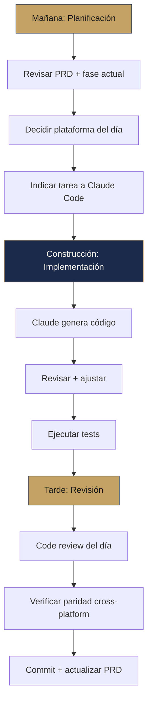

---
tags:
  - prd
  - workflow
  - claude-code
  - solennix
aliases:
  - Guía de Colaboración
  - Collaboration Guide
date: 2026-03-20
updated: 2026-04-04
status: active
---

# Guía de Colaboración con Claude Code

> [!info] Guía unificada
> Maximizar Claude Code en el desarrollo de iOS, Android, Web y Backend — las 4 plataformas de Solennix.

> [!tip] Documentos relacionados
> - [[PRD MOC]] — índice del PRD
> - [[09_ROADMAP|Roadmap]] — fases y timeline
> - [[11_CURRENT_STATUS|Estado Actual]] — qué está implementado
> - [[02_FEATURES|Features]] — catálogo con paridad

---

## Qué Hace Bien Claude Code

### Backend (Go) — [[07_TECHNICAL_ARCHITECTURE_BACKEND|Arq. Backend]]

- Handlers HTTP completos con validación, error handling y respuestas tipadas
- Repository pattern: queries SQL con pgx, parámetros seguros
- Middleware: auth, rate limiting, CORS, security headers
- Migrations SQL: tablas, índices, constraints, ALTER TABLE
- Tests: handler tests con httptest, mocks
- Modelos de datos: structs Go con JSON tags

### Web (React) — [[08_TECHNICAL_ARCHITECTURE_WEB|Arq. Web]]

- Componentes React completos, formularios con react-hook-form + zod
- Servicios API tipados para cada endpoint
- Tailwind UI: layouts responsivos, dark mode
- Charts y dashboards con recharts
- PDF generation con jsPDF
- Tests: Vitest + Playwright

### iOS (SwiftUI) — [[05_TECHNICAL_ARCHITECTURE_IOS|Arq. iOS]]

- Vistas SwiftUI completas, formularios multi-step
- ViewModels @Observable con llamadas API
- Widgets WidgetKit + Live Activity
- PDF generators con UIGraphicsPDFRenderer
- SwiftData models para cache offline
- Navigation + Route enum + deep linking

### Android (Kotlin/Compose) — [[06_TECHNICAL_ARCHITECTURE_ANDROID|Arq. Android]]

- Compose screens Material 3, adaptive layouts
- ViewModels con Hilt, StateFlow
- Room entities + DAOs para offline
- Ktor client con serialization
- Navigation Compose con argumentos tipados

### Cross-Platform

- Traducción de patrones entre Go, Swift, Kotlin y TypeScript
- Code review cruzada para consistencia
- Refactoring y eliminación de código muerto
- Testing unitario e integración
- Actualización del PRD

---

## Qué Requiere Intervención Humana

| Área | Razón | Plataforma |
|------|-------|------------|
| Decisiones de diseño visual | No toma decisiones estéticas subjetivas | Todas |
| Testing en dispositivos reales | Simuladores no reflejan hardware real | Mobile |
| Problemas de OEM | Comportamiento inconsistente entre fabricantes | Android |
| App Store / Play Store submission | Screenshots, metadata, compliance | Mobile |
| Configuración de Stripe | Dashboard, webhooks, product IDs | Backend + Web |
| Certificados y firma | Signing, provisioning, keystores | Mobile |
| DNS y dominios | SSL, subdominios, DNS records | Backend |
| Profiling de rendimiento | Instruments, Android Profiler | Mobile |
| Decisiones de pricing | Precios, tiers, descuentos regionales | Negocio |
| Push notification certificates | APNs keys, Firebase config | Backend + Mobile |

---

## Workflow Recomendado

---

## Prompts de Inicio de Sesión

### Nueva Feature (Backend)
> "Estoy construyendo [endpoint/feature] para Solennix Backend. Lee `PRD/07_TECHNICAL_ARCHITECTURE_BACKEND.md` para contexto. Necesito un nuevo endpoint [POST /api/...] que [descripción]. Crea el handler, repository, y actualiza router.go."

### Nueva Feature (Web)
> "Estoy construyendo [página/componente] para Solennix Web. Lee `PRD/08_TECHNICAL_ARCHITECTURE_WEB.md`. Necesito una nueva página para [descripción]. Crea el componente, el servicio API, y agrega la ruta en App.tsx."

### Nueva Feature (iOS)
> "Estoy construyendo [feature] para Solennix iOS. Lee `PRD/05_TECHNICAL_ARCHITECTURE_IOS.md`. Necesito [descripción]. Crea el ViewModel (@Observable), la vista SwiftUI, y actualiza la navegación."

### Nueva Feature (Android)
> "Estoy construyendo [feature] para Solennix Android. Lee `PRD/06_TECHNICAL_ARCHITECTURE_ANDROID.md`. Necesito [descripción]. Crea el ViewModel (Hilt), la screen Compose, y actualiza el nav graph."

### Corrección de Bug
> "Hay un bug en Solennix [plataforma]: [describir bug]. Los archivos relevantes son [listar]. Debuggeá y proponé un fix. Luego verificá si el mismo bug existe en las otras plataformas."

### Verificación de Paridad
> "Acabo de implementar [feature/fix] en [plataforma]. Verificá que el equivalente existe en las otras plataformas. Si hay diferencias, implementá la paridad."

---

## Integración con SDD

> [!abstract] Spec-Driven Development
> El workflow SDD planifica y ejecuta features sustanciales de forma estructurada.

| Comando | Función |
|---------|---------|
| `/sdd-new nombre-feature` | Crear propuesta enfocada |
| `/sdd-ff nombre-feature` | Fast-forward: specs → diseño → tareas |
| `/sdd-apply nombre-feature` | Implementación en lotes |
| `/sdd-verify nombre-feature` | Verificación contra spec |

### Cuándo usar SDD
- Features nuevas sustanciales (push notifications, export CSV, WhatsApp)
- Refactors que tocan múltiples archivos o capas
- Cambios que requieren coordinación entre 2+ plataformas
- Nuevos endpoints + UI correspondiente

### Cuándo NO usar SDD
- Bug fixes simples
- Cambios cosméticos
- Ajustes de configuración
- Actualizaciones de dependencias

---

## Regla de Paridad Cross-Platform

> [!danger] OBLIGATORIA
> Este es un proyecto de 4 plataformas. Ver [[01_PRODUCT_VISION#Principio de Paridad Cross-Platform|regla de paridad completa]].

| Plataforma cambiada | También revisar |
|---------------------|-----------------|
| Backend (API) | iOS + Android + Web |
| Web | iOS + Android + Backend |
| iOS | Android + Backend |
| Android | iOS + Backend |

### Excepciones (no requieren paridad)

| Feature | Solo en | Razón |
|---------|---------|-------|
| Widgets | Mobile | No existe en web |
| Live Activity | iOS | API exclusiva |
| Core Spotlight | iOS | API exclusiva |
| Admin panel | Web | Solo interfaz interna |
| Biometric | Mobile | No aplica en web |

---

## Archivos Clave para Contexto

> [!tip] Al iniciar sesión, cargar según plataforma

### Siempre
- [[01_PRODUCT_VISION|Visión]] — qué estamos construyendo
- [[02_FEATURES|Features]] — catálogo con paridad
- [[11_CURRENT_STATUS|Estado Actual]] — implementación actual

### Backend
- [[07_TECHNICAL_ARCHITECTURE_BACKEND|Arq. Backend]]
- `backend/internal/router/router.go` — rutas
- `backend/internal/models/models.go` — modelos

### Web
- [[08_TECHNICAL_ARCHITECTURE_WEB|Arq. Web]] y [[Web MOC]]
- `web/src/App.tsx` — rutas
- `web/src/services/` — capa de servicios

### iOS
- [[05_TECHNICAL_ARCHITECTURE_IOS|Arq. iOS]]
- `ios/Packages/SolennixFeatures/` — módulos
- `ios/Packages/SolennixNetwork/.../APIClient.swift` — red

### Android
- [[06_TECHNICAL_ARCHITECTURE_ANDROID|Arq. Android]]
- `android/feature/` — módulos
- `android/core/network/` — capa de red

---

## Efectividad por Fase

| Fase | Backend | Web | iOS | Android | Mejor para |
|------|:-------:|:---:|:---:|:-------:|------------|
| Foundation | 70% | 75% | 65% | 65% | CRUD, scaffolding |
| Features | 60% | 65% | 50% | 55% | Widgets, PDFs, forms |
| Polish | 50% | 55% | 45% | 50% | Accessibility, tests |
| Launch | 30% | 40% | 35% | 30% | Store listings |

### Donde más ahorra tiempo
1. **CRUD completo** (handler + repo + screen + VM + tests) — 60-70%
2. **Traducción cross-platform** (misma feature en 4 lenguajes) — 50-60%
3. **PDF templates** — código repetitivo de layout — 70-80%
4. **Tests unitarios** — generación formulaica — 60-70%
5. **Migraciones SQL** — CREATE TABLE, ALTER, índices — 80%

### Donde necesita más guía
1. Diseño visual — describir exactamente lo que se quiere
2. Edge cases de billing — restore, grace periods, family sharing
3. Offline sync — conflict resolution, merge strategies
4. Performance — profiling requiere herramientas interactivas

---

## Tips de Productividad

> [!tip] Máxima eficiencia

- **Agrupar por plataforma** — no cambiar entre iOS y Android a mitad de sesión
- **Usar sub-agentes** para investigación (docs, APIs)
- **Delegar lo repetitivo** — enfocar energía en UX y decisiones de producto
- **Code review diario** — prevención barata contra deuda técnica
- **Orden óptimo**: Backend → Web → iOS → Android

---

#prd #workflow #claude-code #solennix
