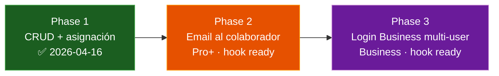

---
tags:
  - feature
  - personal
  - colaboradores
  - phase-1
aliases:
  - Personal Tracker
  - Staff Tracker
  - Colaboradores
date: 2026-04-16
updated: 2026-04-16
status: phase-1-done
---

# 🤝 Personal / Colaboradores — Tracker

> [!success] Phase 1 cerrada 2026-04-16
> Backend + Web + iOS + Android en paridad. Hooks Phase 2 y Phase 3 ya viajan en la migración 042 → futuros sprints son puro código, sin nuevas migraciones.

---

## 🧭 Qué resuelve

Los organizadores tenían un problema silencioso: **dónde anotar al fotógrafo, el DJ, los meseros, el coordinador** de cada evento. Hoy eso vive en la cabeza o en WhatsApp y se pierde. Solennix ahora tiene un catálogo de **colaboradores** (propio por organizer) con asignación a eventos, costos opcionales por evento, y scaffolding para los siguientes dos pasos: notificarles cuando los asignan, y darles login cuando seas cuenta Business.

---

## 📊 Paridad cross-platform

| Capacidad | iOS | Android | Web | Backend |
|---|:-:|:-:|:-:|:-:|
| CRUD catálogo de staff | ✅ | ✅ | ✅ | ✅ |
| Búsqueda (nombre/rol/contacto) | ✅ | ✅ | ✅ | ✅ `?q=` |
| Asignar colaboradores a un evento (Step 4) | ✅ | ✅ | ✅ | ✅ `PUT /events/{id}/items` con `staff[]` |
| Ver asignados en EventDetail (read-only) | ✅ | ✅ | ✅ | ✅ `GET /events/{id}/staff` |
| Fee opcional por asignación | ✅ | ✅ | ✅ | ✅ `event_staff.fee_amount` |
| Toggle "notificar por email al asignar" (solo persiste, no envía) | ✅ | ✅ | ✅ | ✅ `staff.notification_email_opt_in` |

---

## 🗺️ Fases — roadmap



> [!info] Gating por phase
> - **Phase 1:** sin gate — todos los planes pueden usar el catálogo (es CRM interno, no cara-al-cliente).
> - **Phase 2:** notificaciones email = Pro+.
> - **Phase 3:** login + scope de eventos + chat gerente = Business.

---

## 🧱 Data model — migration `042_create_staff_and_event_staff`

### Tabla `staff`

```sql
CREATE TABLE staff (
    id UUID PRIMARY KEY DEFAULT gen_random_uuid(),
    user_id UUID NOT NULL REFERENCES users(id) ON DELETE CASCADE,
    name TEXT NOT NULL,
    role_label TEXT,
    phone TEXT,
    email TEXT,
    notes TEXT,
    notification_email_opt_in BOOLEAN NOT NULL DEFAULT false,  -- hook Phase 2
    invited_user_id UUID REFERENCES users(id) ON DELETE SET NULL,  -- hook Phase 3
    created_at TIMESTAMPTZ NOT NULL DEFAULT NOW(),
    updated_at TIMESTAMPTZ NOT NULL DEFAULT NOW()
);
```

### Tabla `event_staff`

```sql
CREATE TABLE event_staff (
    id UUID PRIMARY KEY DEFAULT gen_random_uuid(),
    event_id UUID NOT NULL REFERENCES events(id) ON DELETE CASCADE,
    staff_id UUID NOT NULL REFERENCES staff(id) ON DELETE CASCADE,
    fee_amount NUMERIC(12,2),
    role_override TEXT,
    notes TEXT,
    notification_sent_at TIMESTAMPTZ,       -- hook Phase 2 dedup
    notification_last_result TEXT,          -- hook Phase 2 outcome
    created_at TIMESTAMPTZ NOT NULL DEFAULT NOW(),
    UNIQUE (event_id, staff_id)
);
```

**Decisiones clave de diseño:**
1. **Tabla dedicada `staff`**, no reuso de `inventory_items.type='staff'`. Semántica distinta (phone/email/role_label vs stock/unit_cost) y Phase 3 necesita FK a `users`.
2. **Fee per-assignment** (`event_staff.fee_amount`), no default en `staff`. Un DJ puede cobrar distinto por evento.
3. **Sin conflict detection** (doble-booking de personas) en Phase 1. Tracked para Phase 1.5.

---

## 🎨 UX per-plataforma

### Web
- Entrada nueva en sidebar **Personal** (icon `UserCog`) entre Clientes y Productos.
- Páginas `/staff`, `/staff/new`, `/staff/:id`, `/staff/:id/edit`.
- Panel **Personal asignado** dentro del Step 4 del EventForm, abajo de Insumos + Equipo. No se agregó un Step 5.

### iOS
- Nueva sección `personnel` en la enum `SidebarSection` (iPad).
- iPhone: entrada dentro de "Más" (NO se agregó un 6º tab).
- Step4 del event form extendido con `Step4PersonnelPanel` subpanel.
- EventDetailView agrega card "Personal asignado" que push `EventStaffDetailView` (read-only).

### Android
- Nuevo módulo `feature:staff` con estructura idéntica a `feature/clients`.
- Entrada en overflow del bottom nav (NO se agregó un 5º tab).
- Room DB bump con migration que agrega `cached_staff` + `cached_event_staff`.
- Panel Personal integrado en la page 3 (Equipment) del EventForm.

---

## 🔌 API reference

| Método | Ruta | Rol |
|---|---|---|
| `GET` | `/api/staff` | Listado paginado del catálogo — `?page=&limit=&sort=&order=` o `?q=` para search |
| `POST` | `/api/staff` | Crear colaborador |
| `GET` | `/api/staff/{id}` | Detalle |
| `PUT` | `/api/staff/{id}` | Actualizar |
| `DELETE` | `/api/staff/{id}` | Eliminar (cascade a event_staff) |
| `GET` | `/api/events/{id}/staff` | Listar asignaciones con joined staff_name/role_label/phone/email |
| `PUT` | `/api/events/{id}/items` | Ahora acepta `staff: [{staff_id, fee_amount?, role_override?, notes?}]` |

---

## 🧪 Verificación

> [!check] Checklist Phase 1 (cerrada)
> - [x] Backend compila limpio + `go vet` verde
> - [x] Mocks + tests actualizados con la nueva signature de `UpdateEventItems`
> - [x] Web `tsc --noEmit` sin errores nuevos (solo errores preexistentes en Settings.tsx)
> - [x] iOS escrito bajo patrón `@Observable` + SwiftUI
> - [x] Android escrito bajo Compose + Hilt + Room migration
> - [x] Paridad cross-platform documentada en PRD/02 §13.ter

> [!todo] Pendiente (Phase 1.5)
> - [ ] Smoke test manual de la feature en cada plataforma
> - [ ] Tests de integración multi-tenant para `staff` en el backend
> - [ ] Openapi spec: agregar schemas `Staff` + `EventStaff` + paths
> - [ ] Deploy manual del backend + correr migration 042 en producción

---

## 🔮 Phase 2 — scaffolding ya en la migración

**No implementado aún — solo hooks:**

1. Columna `staff.notification_email_opt_in BOOLEAN DEFAULT false`.
2. Columnas `event_staff.notification_sent_at` + `notification_last_result`.
3. UI del form ya tiene el toggle y el backend lo persiste.

**Phase 2 va a ser una goroutine en `CRUDHandler.UpdateEventItems`** que, después de persistir `event_staff`, consulta `staff.email` + `notification_email_opt_in`, llama a `emailService.SendCollaboratorAssigned()`, escribe `notification_sent_at`. Mirror del pattern de payment receipt (`crud_handler.go:1658-1679`).

**Gate:** `if user.Plan == "basic" { return }` — se agrega en Phase 2.

---

## 🔮 Phase 3 — scaffolding ya en la migración

**No implementado aún — solo hooks:**

1. Columna `staff.invited_user_id UUID REFERENCES users(id) ON DELETE SET NULL`.

**Phase 3 va a requerir (migration + código, NO solo hook):**

- Nueva migration que amplíe `users.role` CHECK para incluir `'collaborator'`.
- Nueva tabla `staff_invitations (token, staff_id, expires_at, accepted_at)` similar a `event_form_links`.
- `POST /api/staff/{id}/invite` → genera token + email con link.
- `POST /api/public/staff-invitations/{token}/accept` → crea User row con `role='collaborator'`, liga al staff row, setea password.
- Endpoint de signin con auto-redirect al dashboard del colaborador.
- Vista dedicada "Mis eventos asignados" para el colaborador logueado.
- Reuso de PRD/12 feature D (thread de comunicación) cuando esté construida.
- Scoping de acceso — el colaborador logueado SOLO ve:
  ```sql
  events WHERE EXISTS (
      SELECT 1 FROM event_staff
      WHERE event_id = events.id
      AND staff_id IN (
          SELECT id FROM staff WHERE invited_user_id = $collaborator_user_id
      )
  )
  ```

**Gate:** solo cuentas con `plan = 'business'` pueden mandar invitaciones.

---

## 📎 Referencias

- Plan original aprobado: `~/.claude/plans/perfecto-ya-que-estamos-bright-pascal.md`
- PRD features matrix: [[../../PRD/02_FEATURES|02_FEATURES §13.ter]]
- PRD tier gating: [[../../PRD/04_MONETIZATION|04_MONETIZATION §3]]
- PRD roadmap: [[../../PRD/09_ROADMAP|09_ROADMAP Sprint 8.bis]]
- Engram memory topic: `features/personal-colaboradores`
