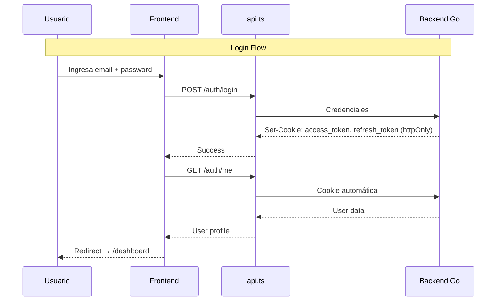
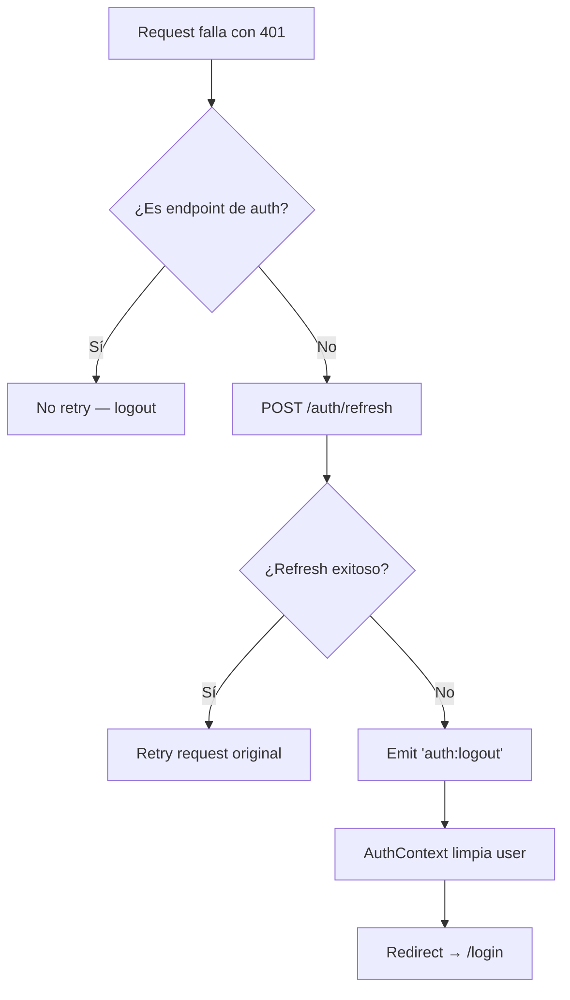
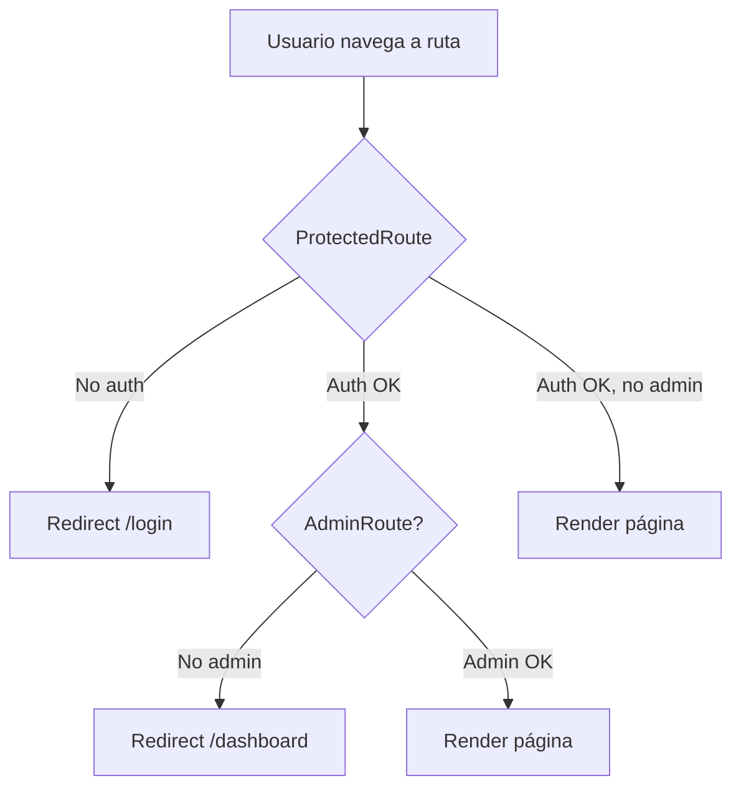

# Autenticación

#web #auth #seguridad

> [!abstract] Resumen
> Autenticación basada en **cookies httpOnly** — sin tokens en localStorage. Soporte para email/password, Google SSO y Apple SSO. Refresh automático de tokens.

---

## Flujo Principal



## Componentes Clave

| Componente | Archivo | Rol |
|-----------|---------|-----|
| **AuthContext** | `contexts/AuthContext.tsx` | Provider global de autenticación |
| **ProtectedRoute** | `components/ProtectedRoute.tsx` | Guard para rutas autenticadas |
| **AdminRoute** | `components/AdminRoute.tsx` | Guard para rutas admin |
| **API Client** | `lib/api.ts` | Manejo de cookies, refresh, logout |

## AuthContext

```typescript
interface AuthContextType {
  user: User | null;       // Usuario autenticado
  profile: User | null;    // Perfil completo (misma entidad)
  loading: boolean;        // Estado de carga inicial
  checkAuth: () => Promise<void>;    // Verifica sesión
  signOut: () => void;               // Cierra sesión
  updateProfile: (data) => Promise<void>;  // Actualiza perfil
}
```

### Ciclo de Vida

1. **Mount** → `checkAuth()` → `GET /auth/me` (cookies automáticas)
2. **Éxito** → `user` y `profile` poblados → render hijos
3. **401** → Intenta refresh → Si falla → `user = null` → redirect a `/login`
4. **Evento `auth:logout`** → `api.ts` lo emite en 401 irrecuperable → AuthContext escucha y limpia

## Token Refresh



> [!important] Seguridad
> - **Sin tokens en localStorage/sessionStorage** — solo cookies httpOnly
> - **credentials: 'include'** en cada request
> - **Deduplicación** de refresh — un solo request concurrent

## SSO (Single Sign-On)

| Proveedor | Componente | Flujo |
|-----------|-----------|-------|
| Google | `GoogleSignInButton.tsx` | Popup Google → Backend recibe code → Cookies httpOnly |
| Apple | `AppleSignInButton.tsx` | Redirect Apple → Backend recibe code → Cookies httpOnly |

## Guards de Ruta



## Relaciones

- [[Routing y Guards]] — Estructura completa de rutas
- [[Capa de Servicios]] — api.ts y su manejo de auth
- [[Manejo de Estado]] — AuthContext como estado global
