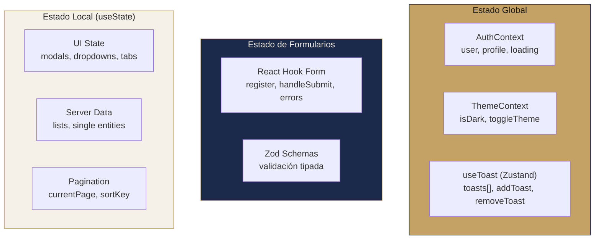
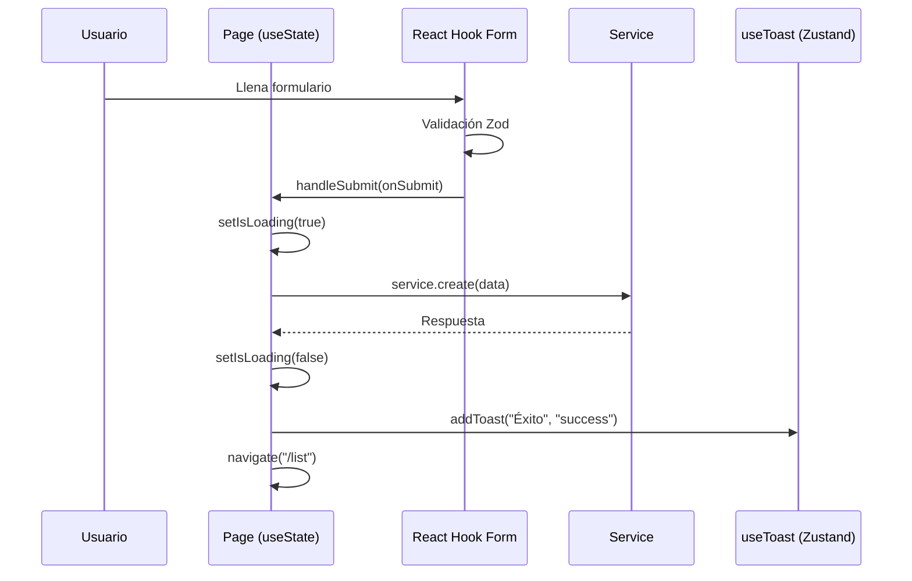

# Manejo de Estado

#web #estado #arquitectura

> [!abstract] Resumen
> Enfoque **híbrido y minimalista**: React Context para estado global, Zustand para notificaciones, React Hook Form para formularios, y useState local para UI.

---

## Estrategia por Tipo de Estado



| Tipo | Herramienta | Ejemplo |
|------|------------|---------|
| Autenticación | React Context | `useAuth()` → `{ user, profile, signOut }` |
| Tema | React Context | `useTheme()` → `{ isDark, toggleTheme }` |
| Toasts | Zustand | `useToast()` → `{ addToast, removeToast }` |
| Formularios | React Hook Form + Zod | `useForm<T>({ resolver: zodResolver(schema) })` |
| Datos del servidor | useState local | `const [events, setEvents] = useState([])` |
| UI transiente | useState local | `const [isOpen, setIsOpen] = useState(false)` |
| Paginación/Sort | Custom hook | `usePagination({ data, itemsPerPage })` |
| Límites de plan | Custom hook | `usePlanLimits()` → `{ canCreateEvent, isBasicPlan }` |

## Detalle de Cada Capa

### 1. AuthContext (Context)

```
contexts/AuthContext.tsx
```

- Provee `user`, `profile`, `loading`, `checkAuth()`, `signOut()`, `updateProfile()`
- Se inicializa en el mount llamando a `GET /auth/me`
- Escucha evento `auth:logout` para limpiar sesión

### 2. ThemeContext (Context)

```
hooks/useTheme.ts → contexts/ThemeContext.tsx
```

- Provee `isDark`, `toggleTheme()`
- Persiste en `localStorage`
- Aplica clase `.dark` / `.light` a `<html>`

### 3. useToast (Zustand)

```
hooks/useToast.ts
```

- **Único store Zustand** en la app
- `addToast(message, type)` → auto-dismiss en 3 segundos
- Tipos: `success`, `error`, `info`
- Renderizado por `ToastContainer` en el Layout

### 4. React Hook Form + Zod

Patrón estándar en todos los formularios:

```typescript
const schema = z.object({
  name: z.string().min(2, "Mínimo 2 caracteres"),
  email: z.string().email("Email inválido"),
});

type FormData = z.infer<typeof schema>;

const { register, handleSubmit, formState: { errors } } = useForm<FormData>({
  resolver: zodResolver(schema),
});
```

Formularios que usan RHF+Zod:
- Login, Register, ForgotPassword
- ClientForm, EventForm (sub-components)
- ProductForm, InventoryForm
- Settings (password change)

### 5. Server State (Local)

> [!warning] Sin React Query
> La app NO usa React Query/TanStack Query. Los datos del servidor se manejan con `useState` + `useCallback` + `useEffect`. Esto significa:
> - No hay cache automático
> - No hay refetch en foco
> - No hay deduplicación de requests
> - Cada página hace su propio fetch al montar

Patrón típico:
```typescript
const [data, setData] = useState<Entity[]>([]);
const [loading, setLoading] = useState(true);

const fetchData = useCallback(async () => {
  setLoading(true);
  try {
    const result = await service.getAll();
    setData(result || []);
  } catch (error) {
    logError("Error", error);
    addToast("Error al cargar", "error");
  } finally {
    setLoading(false);
  }
}, [addToast]);

useEffect(() => { fetchData(); }, [fetchData]);
```

## Flujo de Estado en una Acción Típica



## Relaciones

- [[Autenticación]] — AuthContext en detalle
- [[Hooks Personalizados]] — Implementación de cada hook
- [[Arquitectura General]] — Contexto completo del stack
