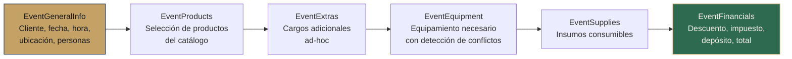

# Módulo Eventos

#web #eventos #dominio

> [!abstract] Resumen
> Módulo central de la app. CRUD completo de eventos con formulario multi-paso, cotización rápida, resumen detallado, generación de PDFs, y gestión de pagos integrada con Stripe.

---

## Páginas

| Página | Ruta | Descripción |
|--------|------|-------------|
| **EventList** | `/events` | Tabla con status chips, búsqueda, sort, paginación, export CSV |
| **EventForm** | `/events/new`, `/events/:id/edit` | Formulario multi-paso: general, productos, extras, equipo, insumos, financieros |
| **EventSummary** | `/events/:id/summary` | Vista completa del evento con todos los line items, pagos, PDFs |
| **EventPaymentSuccess** | `/events/:id/payment-success` | Confirmación post-pago Stripe |
| **QuickQuotePage** | `/cotizacion-rapida` | Cotización rápida sin crear evento completo |

## Formulario Multi-Paso



### Sub-componentes del Form

| Componente | Archivo | Función |
|-----------|---------|---------|
| `EventGeneralInfo` | `Events/components/EventGeneralInfo.tsx` | Datos básicos: cliente, fecha, hora, servicio, ubicación, personas |
| `EventProducts` | `Events/components/EventProducts.tsx` | Selección de productos del catálogo con cantidades y precios |
| `EventExtras` | `Events/components/EventExtras.tsx` | Ítems adicionales fuera del catálogo |
| `EventEquipment` | `Events/components/EventEquipment.tsx` | Equipamiento con detección de conflictos por fecha |
| `EventSupplies` | `Events/components/EventSupplies.tsx` | Insumos consumibles con cantidades |
| `EventFinancials` | `Events/components/EventFinancials.tsx` | Descuento (% o fijo), impuesto, depósito, reembolso, total |
| `Payments` | `Events/components/Payments.tsx` | Registro de pagos con Stripe checkout |
| `QuickClientModal` | `Events/components/QuickClientModal.tsx` | Crear cliente inline sin salir del form |

## Estados del Evento

```mermaid
stateDiagram-v2
    [*] --> Cotizado
    Cotizado --> Confirmado : Cliente acepta
    Cotizado --> Cancelado : Cliente rechaza
    Confirmado --> Completado : Evento realizado
    Confirmado --> Cancelado : Cancelación

    state Cotizado {
        note right: Status inicial al crear
    }
    state Completado {
        note right: Estado final exitoso
    }
```

Cambio de estado via `StatusDropdown` component directamente en la tabla.

## Servicio API

```
services/eventService.ts
```

| Método | Endpoint | Descripción |
|--------|----------|-------------|
| `getAll()` | GET /events | Todos los eventos del usuario (con cliente join) |
| `getById(id)` | GET /events/:id | Evento individual con productos, extras, equipo, insumos |
| `create(data)` | POST /events | Crear evento completo |
| `update(id, data)` | PUT /events/:id | Actualizar evento |
| `delete(id)` | DELETE /events/:id | Eliminar evento y datos asociados |
| `getUpcoming()` | GET /events/upcoming | Próximos eventos (Dashboard) |
| `getByDateRange()` | GET /events?from=&to= | Eventos por rango de fechas (Calendario) |
| `getByClientId()` | GET /events?client_id= | Eventos de un cliente específico |

## Generación de PDFs

Desde `EventSummary`, el usuario puede generar:

| PDF | Contenido |
|-----|-----------|
| **Presupuesto** | Productos, extras, totales, descuento, impuesto |
| **Contrato** | Template customizado con tokens (nombre, fecha, monto, etc.) |
| **Factura** | Ítems, pagos realizados, saldo pendiente |
| **Lista de Compras** | Ingredientes/insumos necesarios por producto |
| **Checklist** | Lista de tareas para el día del evento |
| **Reporte de Pagos** | Historial completo de pagos del evento |

Todos los PDFs incluyen logo del negocio y brand color si están configurados.

## Relaciones

- [[Módulo Clientes]] — Eventos vinculados a clientes
- [[Módulo Productos]] — Productos del catálogo usados en eventos
- [[Módulo Inventario]] — Equipamiento e insumos asignados
- [[Módulo Pagos]] — Pagos registrados contra eventos
- [[Sistema de PDFs]] — Generación de documentos
- [[Capa de Servicios]] — eventService
