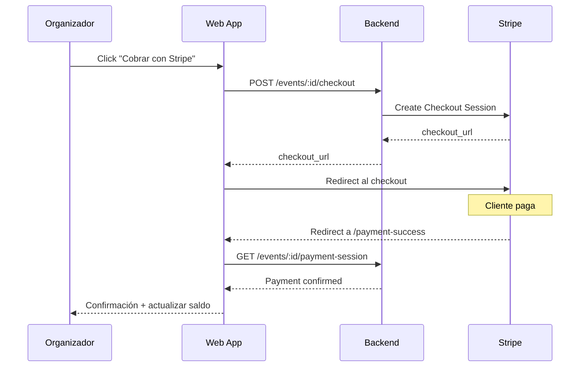

# Módulo Pagos

#web #pagos #dominio #stripe

> [!abstract] Resumen
> Sistema de registro de pagos vinculados a eventos. Integración con Stripe para checkout online. Soporte para pagos parciales con tracking de saldo pendiente.

---

## Componentes

| Componente | Ubicación | Función |
|-----------|-----------|---------|
| **Payments** | `Events/components/Payments.tsx` | Formulario RHF+Zod para registrar pagos + lista de pagos existentes |
| **EventPaymentSuccess** | `Events/EventPaymentSuccess.tsx` | Página de confirmación post-checkout Stripe |

## Entidad

```typescript
interface Payment {
  id: string;
  event_id: string;
  amount: number;
  payment_date: string;
  payment_method: string;   // "Efectivo", "Transferencia", "Tarjeta", etc.
  status: string;
  notes?: string;
}
```

## Funcionalidades

- **Registro manual** — Monto, fecha, método de pago, notas
- **Stripe Checkout** — Link de pago online para el cliente
- **Depósito sugerido** — Calcula automáticamente el % de depósito configurado
- **Saldo pendiente** — Total del evento menos pagos realizados
- **Historial** — Lista de todos los pagos con fecha y método

## Servicios

### paymentService (pagos manuales)

| Método | Endpoint | Descripción |
|--------|----------|-------------|
| `getByEventId(id)` | GET /payments?event_id= | Pagos de un evento |
| `create(data)` | POST /payments | Registrar pago |
| `update(id, data)` | PUT /payments/:id | Actualizar pago |
| `delete(id)` | DELETE /payments/:id | Eliminar pago |

### eventPaymentService (Stripe)

| Método | Endpoint | Descripción |
|--------|----------|-------------|
| `createCheckoutSession()` | POST /events/:id/checkout | Crear sesión de Stripe Checkout |
| `getPaymentSession()` | GET /events/:id/payment-session | Verificar estado del pago |

### subscriptionService (suscripciones)

| Método | Endpoint | Descripción |
|--------|----------|-------------|
| `getStatus()` | GET /subscription/status | Estado actual de la suscripción |
| `createCheckoutSession()` | POST /subscription/checkout | Iniciar pago de suscripción |
| `createPortalSession()` | POST /subscription/portal | Abrir portal de gestión Stripe |

## Flujo de Pago con Stripe



## Relaciones

- [[Módulo Eventos]] — Pagos vinculados a eventos
- [[Capa de Servicios]] — paymentService, eventPaymentService, subscriptionService
